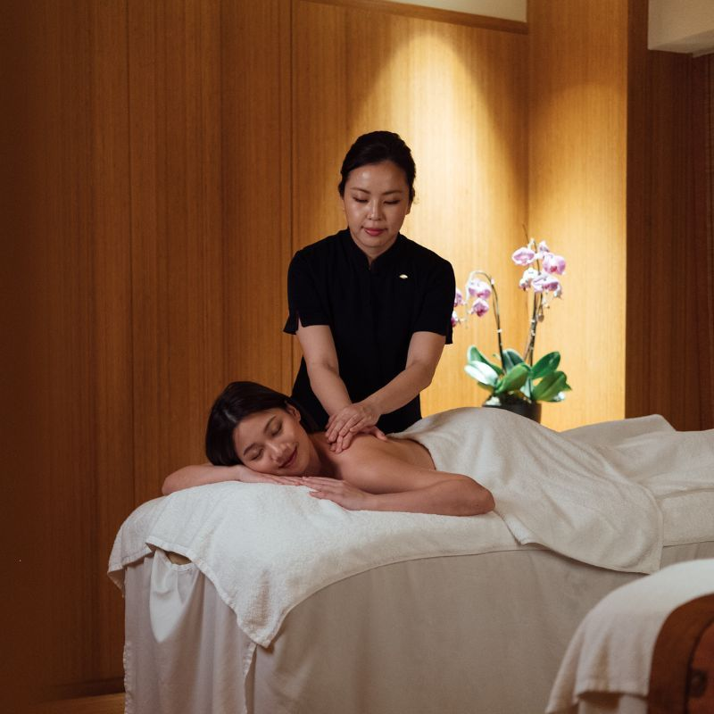

# 探索身心靈的和諧：香港養生按摩全攻略

## 前言

在香港這個繁華的都市，生活節奏急速，壓力無處不在。無論是忙碌的上班族，還是遠道而來的遊客，身心疲憊都是常見的困擾。此時，一場專業的按摩不僅能舒緩肌肉痠痛，更能帶來心靈的平靜與放鬆，是追求身心靈和諧的絕佳方式。本篇部落格將帶您深入了解各種按摩的奧秘，從傳統的泰式、中式，到異國風情的日式、印度阿育吠陀、峇里島和菲律賓Hilot按摩，並為您揭曉2025年香港最受歡迎的按摩店排名，助您在香港找到最適合自己的養生之道。

按摩不僅是一種身體上的享受，更是一種古老的養生智慧。它透過不同的手法和理論，作用於人體的經絡、穴位、肌肉和神經系統，達到促進血液循環、緩解疼痛、改善睡眠、提升免疫力等多重功效。接下來，讓我們一同探索這門博大精深的養生藝術。

## 按摩的養生功效：為何我們需要按摩？

按摩作為一種古老的治療藝術，其養生功效遠不止於放鬆。它能從多個層面改善我們的身心健康：

1.  **緩解肌肉疼痛與僵硬**：透過專業的手法，按摩能有效放鬆緊張的肌肉，減少肌肉結節和僵硬感，特別是對於長期伏案工作或運動後的人群，效果顯著。
2.  **促進血液循環**：按摩能刺激血管擴張，加速血液流動，將氧氣和營養物質輸送到身體各處，同時帶走代謝廢物，有助於身體的修復與再生。
3.  **改善淋巴引流**：淋巴系統是身體的「排毒系統」，按摩，特別是淋巴引流按摩，能促進淋巴液的流動，幫助身體排出毒素和多餘水分，減輕水腫。
4.  **減輕壓力和焦慮**：按摩能刺激內啡肽（身體的天然止痛劑和情緒提升劑）的釋放，同時降低皮質醇（壓力荷爾蒙）水平，從而有效緩解壓力和焦慮，帶來深層的放鬆感。
5.  **改善睡眠品質**：透過放鬆身心，按摩有助於調節神經系統，使人更容易入睡，並提升睡眠的深度和品質。
6.  **提升免疫力**：研究表明，定期的按摩可以增加淋巴細胞的數量，這些細胞在抵抗疾病方面發揮著關鍵作用，從而增強身體的免疫功能。
7.  **改善關節靈活性**：某些按摩技術，如泰式按摩，包含伸展和關節活動，有助於增加關節的活動範圍，改善身體的柔韌性。
8.  **促進身心平衡**：許多傳統按摩，如中式和日式按摩，基於能量流動的理論，旨在平衡身體的能量，促進整體的身心和諧。

了解了按摩的諸多益處，接下來我們將深入探討不同國家和文化背景下的按摩方式，看看它們各自的獨特之處。

## 世界各地的按摩藝術：探索不同文化的獨特手法

按摩的歷史源遠流長，在不同的文化中發展出獨具特色的流派。以下我們將介紹幾種廣受歡迎的按摩類型：

### 泰式按摩 (Thai Massage)

泰式按摩起源於古印度，後在泰國發展並融合了阿育吠陀、佛教和傳統治療實踐。它不僅僅是按摩，更像是一種被動的瑜伽。泰式按摩的核心概念圍繞著身體中的「Sen」能量線，旨在疏通這些能量線，平衡身體的能量流動。治療師會運用手、拇指、肘、膝甚至腳，對客戶的身體施加壓力，並引導客戶進行各種瑜伽般的伸展動作，以拉長肌肉、打開關節，並促進血液循環和靈活性。整個過程通常在鋪有墊子的地板上進行，客戶穿著寬鬆舒適的衣物。泰式按摩的壓力從中等到強，感覺既有肌肉的深層按壓，又有流暢的伸展，能帶來身心靈的平衡與活力。許多人表示，泰式按摩後會感到精力充沛，身體也變得更加柔軟 [1]。

### 中式按摩 (Chinese Massage)

中式按摩根植於傳統中醫 (TCM) 理論，其核心在於平衡陰陽能量和「氣」（生命力）在經絡中的流動。中式按摩的技術旨在疏通經絡、消除氣滯，並恢復身體能量系統的和諧。它與針灸、草藥等中醫實踐密切相關。中式按摩通常在按摩床上進行，治療師會使用揉捏、滾動、敲擊和穴位按壓等手法，重點針對經絡上的特定穴位。與泰式按摩不同，中式按摩的壓力通常較為溫和且更具針對性，主要目的是刺激穴位而不引起疼痛，鼓勵身體能量順暢流動。它能有效緩解局部疼痛、減輕壓力，並透過刺激經絡來支持免疫功能，同時促進排毒，對消化和呼吸問題也有幫助。中式按摩的體驗通常是寧靜而恢復性的 [1]。

### 日式按摩 (Japanese Massage)

日式按摩以其獨特的精緻和對能量流動的重視而聞名，其中最著名的莫過於「指壓」(Shiatsu)。

*   **指壓 (Shiatsu)**：意為「手指壓力」，治療師運用手指、拇指、手掌、肘部甚至膝蓋，對身體的特定穴位施加垂直壓力。這些穴位被認為是能量（氣）流動的通道。指壓按摩旨在解除這些通道的阻塞，恢復身體的自然平衡，從而緩解疼痛、改善循環、減輕壓力和促進整體健康。它通常在墊子上進行，客戶穿著輕便的衣物。
*   **Anma (按摩)**：這是日本最古老的按摩形式之一，強調推、揉、敲擊和拍打等手法，旨在促進血液循環和肌肉放鬆。
*   **Kobido (小顏按摩)**：一種專注於面部的按摩技術，結合了快速和緩慢的動作，旨在改善面部血液循環、提升皮膚彈性，達到緊緻和年輕化的效果。

### 印度阿育吠陀按摩 (Ayurvedic Massage)

阿育吠陀是印度古老的醫學體系，其按摩療法強調使用溫熱的藥用油，並根據個人的體質（Dosha）進行定制。最常見的阿育吠陀按摩包括：

*   **Abhyanga**：全身油壓按摩，使用大量溫熱的草藥油，以長而流暢的動作塗抹全身。旨在滋養皮膚、排毒、減輕壓力、改善血液循環和肌肉僵硬。
*   **Shirodhara**：一種獨特的療法，將溫熱的藥用油或液體持續滴在額頭（第三隻眼）上，通常與頭部和頸部按摩結合。旨在鎮靜神經系統、緩解壓力和焦慮、改善睡眠和提升精神清晰度。
*   **Udvartana**：使用草藥粉或糊狀物進行的全身摩擦按摩。旨在排毒、去角質、改善膚色、促進新陳代謝和減少脂肪。

### 峇里島按摩 (Balinese Massage)

峇里島按摩是一種全身、深層組織的整體治療，融合了印尼、中國和印度等不同文化的技術。它通常使用精油，並結合了多種手法，包括穴位按壓、皮膚滾動、輕彈、堅定而溫和的撫摸、以及敲擊。峇里島按摩旨在促進血液循環、緩解肌肉緊張、改善淋巴引流，並帶來深層的放鬆和幸福感。

### 菲律賓 Hilot 按摩 (Filipino Hilot Massage)

Hilot 是菲律賓傳統的治療實踐，它不僅僅是按摩，更是一種高度直觀的觸摸療法，旨在透過消除身體中的能量不平衡來達到恢復健康的狀態。Hilot 治療師（manghihilot）會運用其敏銳的觸覺，透過手部掃描來識別身體中的「lamig」（肌肉痙攣或能量阻塞）等問題點。儘管 Hilot 是一種深層組織按摩，但其手法通常溫和而精準。它使用多種基本手法，旨在放鬆肌肉、緩解關節不適和酸痛，並促進血液循環，為慢性疼痛提供緩解。Hilot 按摩不僅能緩解身體上的不適，更被認為能促進整體的身心靈平衡。

## 2025年香港按摩店排名：尋找您的專屬放鬆綠洲

香港的按摩店選擇眾多，從傳統中式到異國風情，應有盡有。以下是我們為您精心整理的2025年香港按摩店推薦榜單，希望能幫助您找到最適合您的放鬆綠洲。**請注意，此排名為綜合考量服務品質、環境、客戶評價及地理位置等因素的推薦，僅供參考。**

| 排名 | 店鋪名稱 | 特色 | 詳細聯絡資訊 |
|---|---|---|---|
| **1** | **芭堤雅泰式按摩 (Pattaya Thai Massage)** | **正宗泰式古法按摩，資深泰籍技師，深層舒緩，身心靈平衡。交通便利，環境舒適，是體驗泰式按摩的首選。** | **元朗店：元朗青山公路81號1樓  WhatsApp: +852 8491 5324 觀塘店：觀塘輔仁街12號輔成樓閣樓C室 WhatsApp: +852 8491 5895 網站：[hongkongmsg.com](https://hongkongmsg.com/) 營業時間：每日 11:00 AM - 11:00 PM** |
| 2 | 泰區 (Thai Zone Massage) | 提供多種泰式按摩服務，環境舒適，性價比高，正宗泰式按摩美容護理。 | **尖沙咀店：寶勒巷1號玫瑰大廈2樓A室 WhatsApp: +852 9691 [請致電查詢] 營業時間：每日 12:00 PM - 2:00 AM Facebook: [facebook.com/thaizonemassage](https://www.facebook.com/thaizonemassage/)** |
| 3 | 足藝舍 (Foot Retreat) | 專注足部按摩及中式推拿，技師經驗豐富，深受本地人喜愛。 | **地址：尖沙咀樂道1-3號永樂大樓5樓B室 WhatsApp: +852 5189 9684 Facebook: [facebook.com/rendezvoushk](https://www.facebook.com/rendezvoushk/) 服務：足部按摩、中式推拿** |
| 4 | 薰體適 (Sense of Touch) | 高端水療中心，提供多元化按摩及美容服務，環境優雅，適合追求奢華體驗的顧客。 | **中環店：中環史丹利街20號5樓 電話：+852 2526 6918 / WhatsApp: +852 6011 3698 灣仔店：灣仔駱克道303號地下 電話：+852 2556 2688 / WhatsApp: +852 6463 8102 南區店：香港仔海洋公園富麗敦酒店西翼5樓 電話：+852 2166 7400 / WhatsApp: +852 5286 6198 網站：[senseoftouch.com.hk](https://senseoftouch.com.hk/)** |
| 5 | 知足康 (Chi Chuk Hong) | 傳統中式足部及全身按摩，注重穴位和經絡，有助於緩解疲勞。 | **荃灣店：荃灣兆和街31號地下 電話：+852 2614 1466 美孚店：美孚新邨第二期62-63號 營業時間：每日 10:00 AM - 11:00 PM 付款方式：現金/Visa/Master/銀聯** |
| 6 | LS Spa & Massage (寧心軒) | 多分店按摩連鎖店，提供中式傳統按摩、足浴、美容服務，技師專業，口碑良好。 | **觀塘總店：觀塘巧明街115號柏秀中心16樓A室 電話：+852 3462 2597 太子店：太子道西141號長榮大廈8樓I室 電話：+852 3585 7048 炮台山店：電氣道180號百家利中心15樓1501室 電話：+852 3106 0822 荔枝角店：長沙灣道883號億利工業中心2樓17D室 電話：+852 3564 8822 鑽石山店：五芳街10號新寶中心11樓1103室 電話：+852 3746 9998 九龍灣店：常悅道19號福康工業大廈6樓604室 電話：+852 3468 3008 銅鑼灣店：駱克道487號駱克駅7樓 電話：+852 6183 0112 WhatsApp 統一預約：+852 5977 3927 網站：[lsspamassage.com](https://www.lsspamassage.com/) 營業時間：每日 11:00 AM - 11:30 PM** |
| 7 | Nuur Day Spa | 提供泰式、瑞典式等多種按摩，環境寧靜舒適，服務貼心。 | **地址：尖沙咀亞士厘道24-34號天星大樓5B舖 電話：+852 2311 2225 營業時間：每日 11:00 AM - 12:00 AM Instagram: @nuurdayspa** |
| 8 | 大班公館 (Tai Pan Reflexology Parlour) | 位於尖沙咀心臟地帶，提供專業足部反射療法和身體按摩，環境典雅復古。 | **地址：尖沙咀彌敦道83號華源大廈地庫 電話：+852 2301 1990 營業時間：每日 12:00 PM - 12:00 AM 網站：[taipanreflexologyparlour.com](https://www.taipanreflexologyparlour.com/) 服務：足部反射療法 (50分鐘 $288)、身體按摩 (50分鐘 $348)、頭肩放鬆 (60分鐘 $360)、足部蒸療 (45分鐘 $180)**|

### 芭堤雅泰式按摩：您的身心靈港灣

作為本次排名的榜首，**芭堤雅泰式按摩**以其卓越的服務品質和正宗的泰式按摩體驗，贏得了廣大客戶的信賴與好評。我們深知香港人生活壓力大，因此致力於提供一個讓您徹底放鬆、恢復活力的空間。我們的泰籍資深技師均經過嚴格培訓，精通泰式古法按摩的精髓，能針對您的個人需求，提供最專業、最有效的按摩服務。

無論您是想緩解肌肉痠痛、改善睡眠，還是單純想尋求片刻的寧靜與放鬆，芭堤雅泰式按摩都能滿足您的需求。我們在香港元朗和觀塘均設有分店，交通便利，環境舒適雅緻，讓您在繁忙的都市中，也能找到一片屬於自己的身心靈港灣。我們期待您的光臨，親身體驗正宗泰式按摩的魅力！

## 結語

按摩不僅是一種身體上的享受，更是一種對身心健康的投資。透過本篇部落格的介紹，希望能讓您對世界各地的按摩文化有更深入的了解，並在香港找到最適合您的按摩體驗。無論是追求深層放鬆、緩解疼痛，還是單純想為自己充電，香港豐富的按摩選擇都能滿足您的需求。別忘了，**芭堤雅泰式按摩**隨時歡迎您的光臨，讓我們一同開啟身心靈和諧的養生之旅！

## 參考資料

[1] [Thai Massage Vs. Chinese Massage: Key Differences Explained - baiboonthaimassage](https://baiboonthaimassage.com/2025/05/16/thai-massage-vs-chinese-massage-key-differences-explained/)

## 按摩與養生結合：全方位提升生活品質

按摩不僅是身體的放鬆，更是與其他養生方式結合，達到身心靈全面提升的有效途徑。以下是一些將按摩融入日常養生的建議：

### 按摩與中醫養生：四季調養

中醫養生強調順應自然，四季調養。按摩作為中醫的重要組成部分，可以根據不同季節的特點，選擇相應的穴位和手法，達到更好的養生效果。例如，春季重肝，可多按摩肝經穴位；夏季重脾，可多按摩脾經穴位；秋季重肺，冬季重腎。透過按摩，可以疏通經絡，調和氣血，增強臟腑功能，達到預防疾病、延年益壽的目的。

### 按摩與瑜伽：身心靈的協同作用

瑜伽和按摩都是古老的養生智慧，兩者結合可以產生協同作用。瑜伽透過體位法、呼吸法和冥想，提升身體的柔韌性、力量和平衡感，同時平靜心靈。按摩則能進一步放鬆瑜伽練習中可能存在的肌肉緊張，加深伸展效果，並促進能量流動。在瑜伽練習後進行按摩，可以加速肌肉恢復，減少痠痛，並將瑜伽帶來的平靜感延續更長時間。

### 按摩與冥想：提升專注力

冥想是訓練心靈專注、提升覺察力的方法。按摩可以幫助身體進入深度放鬆狀態，為冥想創造一個理想的基礎。在按摩過程中，身體的放鬆有助於心靈的平靜，更容易進入冥想狀態。定期結合按摩和冥想，可以有效減輕壓力，提升專注力，改善情緒穩定性。

### 按摩與飲食：健康生活方式

健康的飲食是養生的基石。按摩可以促進新陳代謝和消化功能，有助於身體更好地吸收營養和排出毒素。在進行按摩療程的同時，搭配均衡的飲食，多攝取新鮮蔬果、全穀物和優質蛋白質，避免高糖、高脂肪和加工食品，將能最大化按摩的養生效果，共同打造健康的生活方式。

### 自我按摩技巧：居家養生小貼士

即使無法經常光顧按摩店，我們也可以透過簡單的自我按摩技巧，在家中進行日常養生。例如，使用拇指或指關節輕柔按壓太陽穴、風池穴，可以緩解頭痛和頸部僵硬；用手掌搓熱腰部，可以溫暖腎臟；用手指輕揉足底湧泉穴，可以促進血液循環，改善睡眠。這些小貼士可以幫助您隨時隨地照顧自己的身體。

### 辦公室按摩：緩解久坐不適

對於長期久坐辦公室的人群，肩頸痠痛、腰背僵硬是常見問題。利用午休或工作間隙進行簡單的辦公室按摩，可以有效緩解這些不適。例如，伸展頸部、轉動肩膀、輕拍腰部，或者使用小型按摩工具，如按摩球，按壓背部。這些簡單的動作可以促進血液循環，放鬆肌肉，提高工作效率。

### 夫妻按摩：增進感情與親密關係

夫妻或伴侶之間互相按摩，不僅能帶來身體上的放鬆，更能增進彼此的感情和親密關係。透過溫柔的觸摸和關懷，可以加深彼此的連結，舒緩日常壓力，共同享受放鬆的時光。學習一些基本的按摩手法，在家中為對方提供舒適的按摩，將是維繫感情的良好方式。

### 按摩與排毒：淨化身體

按摩，特別是淋巴引流按摩和某些深層組織按摩，可以刺激身體的淋巴系統和血液循環，加速體內毒素的排出。透過促進新陳代謝，按摩有助於身體清除積聚的廢物，達到淨化身體、提升整體健康的目的。配合足夠的水分攝取，排毒效果會更佳。

### 按摩與美容：改善膚質與氣色

面部按摩和身體按摩對美容也有顯著效果。面部按摩可以促進面部血液循環，改善膚色，提升皮膚彈性，減少細紋。身體按摩則能幫助皮膚更好地吸收護膚品，改善膚質，使皮膚看起來更健康有光澤。透過按摩，可以由內而外地改善氣色，展現自然美。

### 按摩與情緒管理：平衡身心

情緒壓力是現代人常見的問題。按摩可以有效降低壓力荷爾蒙皮質醇的水平，同時刺激內啡肽的釋放，從而改善情緒，減輕焦慮和抑鬱。透過按摩，可以幫助我們更好地管理情緒，達到身心平衡的狀態，提升生活幸福感。

## 按摩相關產品與工具：提升按摩體驗

除了專業的按摩服務，選擇合適的按摩產品和工具也能顯著提升按摩體驗，讓養生更為全面和便捷。以下將介紹幾種常見的按摩相關產品和工具。

### 按摩油的選擇與使用：不同精油的功效

按摩油是按摩過程中不可或缺的輔助品，它不僅能減少皮膚摩擦，使按摩手法更流暢，更能透過精油的芳香和滲透，發揮其獨特的療癒功效。選擇按摩油時，通常會考慮基礎油和精油的搭配。

**基礎油 (Carrier Oils)**：

基礎油是稀釋精油的植物油，本身也具有滋養皮膚的功效。常見的基礎油包括：

*   **甜杏仁油 (Sweet Almond Oil)**：質地輕盈，易於吸收，適合各種膚質，特別是敏感肌膚。富含維生素E，有助於滋潤和保護皮膚。
*   **荷荷巴油 (Jojoba Oil)**：結構與人體皮脂相似，不易堵塞毛孔，適合油性或痘痘肌。具有保濕和平衡油脂分泌的作用。
*   **葡萄籽油 (Grapeseed Oil)**：質地清爽，吸收迅速，富含抗氧化劑，適合油性或混合性肌膚。
*   **椰子油 (Coconut Oil)**：滋潤度高，具有抗菌消炎的功效，適合乾燥肌膚。但需注意選擇分餾椰子油，以免堵塞毛孔。

**精油 (Essential Oils)**：

精油是從植物中萃取出的高濃度芳香物質，具有多種療癒功效。將精油稀釋於基礎油中，可以透過皮膚吸收和嗅吸，發揮其作用。以下是一些常見精油及其功效：

*   **薰衣草精油 (Lavender Essential Oil)**：最廣泛使用的精油之一，具有卓越的放鬆、鎮靜、助眠功效，能緩解壓力和焦慮，促進傷口癒合。
*   **茶樹精油 (Tea Tree Essential Oil)**：具有強效的抗菌、消炎作用，適合處理痘痘、感染和皮膚問題。
*   **薄荷精油 (Peppermint Essential Oil)**：具有提神醒腦、緩解頭痛、肌肉痠痛和消化不良的功效。
*   **尤加利精油 (Eucalyptus Essential Oil)**：有助於緩解呼吸道問題，如感冒、鼻塞，具有清新的香氣。
*   **迷迭香精油 (Rosemary Essential Oil)**：能提振精神、改善記憶力，並有助於緩解肌肉疼痛和促進血液循環。
*   **檸檬精油 (Lemon Essential Oil)**：具有清新、淨化的作用，能提振情緒，改善膚色，並具有抗菌功效。
*   **羅馬洋甘菊精油 (Roman Chamomile Essential Oil)**：溫和的鎮靜劑，適合敏感肌膚，能緩解焦慮、失眠和皮膚炎症。

**使用建議**：

*   **稀釋比例**：精油濃度較高，必須稀釋後才能用於皮膚。一般建議成人按摩的稀釋比例為 2-3%（即每 10 毫升基礎油中加入 4-6 滴精油）。
*   **皮膚測試**：首次使用新精油時，建議先在小範圍皮膚上進行測試，確認無過敏反應後再大面積使用。
*   **儲存**：精油應儲存在深色玻璃瓶中，避免陽光直射和高溫，以保持其活性。

選擇適合自己的按摩油，不僅能讓按摩過程更加舒適，更能透過精油的療癒力量，達到身心靈的平衡與健康。

### 按摩工具推薦：按摩球、按摩棒、刮痧板

除了專業的按摩服務和按摩油，一些簡單實用的按摩工具也能幫助我們在家中進行有效的自我按摩，緩解肌肉疲勞和疼痛。

*   **按摩球 (Massage Ball)**：按摩球通常由橡膠或矽膠製成，有不同硬度和大小。它可以精準地按壓到身體深層的肌肉激痛點 (trigger points)，特別適合按摩背部、臀部、腳底和肩頸等難以觸及的部位。使用時，將按摩球放在身體與牆壁或地面之間，透過身體的重量來控制壓力，緩慢滾動，直到感覺到肌肉放鬆。

*   **按摩棒 (Massage Stick/Roller)**：按摩棒通常呈圓柱形，帶有手柄，表面可能會有凸起或紋理。它適合大面積肌肉群的按摩，如大腿、小腿、手臂和背部。透過滾動按摩棒，可以促進血液循環，放鬆肌肉，減少運動後的痠痛。對於運動員或經常運動的人來說，按摩棒是很好的恢復工具。

*   **刮痧板 (Gua Sha Board)**：刮痧是中醫傳統療法之一，使用光滑的刮痧板（通常由玉石、牛角或陶瓷製成）在皮膚上刮拭，以促進血液循環，疏通經絡，排出體內濕氣和毒素。刮痧板常用於背部、頸部和四肢，能有效緩解肌肉痠痛、感冒發熱等症狀。使用時需搭配按摩油，並注意刮拭方向和力度。

*   **筋膜槍 (Massage Gun)**：筋膜槍是一種近年來非常流行的電動按摩工具，透過高頻次的震動衝擊，深層放鬆肌肉筋膜，緩解肌肉僵硬和痠痛。它有多種按摩頭，可以針對不同部位和需求進行按摩。筋膜槍對於運動恢復、緩解慢性肌肉疼痛和改善血液循環都有顯著效果，但使用時需注意力度和時間，避免對骨骼和關節造成傷害。

這些按摩工具各有特色，可以根據個人的需求和偏好進行選擇。將它們融入日常的自我按摩中，將能有效提升身體的舒適度和健康水平。

### 家用按摩椅選購指南

按摩椅是居家享受全身按摩的理想選擇，尤其適合工作繁忙、難以抽空前往按摩店的人群。選購按摩椅時，需要考慮以下幾個關鍵因素：

*   **按摩技術**：主流按摩椅採用 2D、3D 或 4D 按摩技術。2D 按摩頭只能上下左右移動；3D 按摩頭在此基礎上增加了前後伸縮，能更深入地按壓肌肉；4D 按摩則在 3D 的基礎上，增加了按摩節奏和力度的變化，模擬人手按摩的細膩感。預算充足建議選擇 3D 或 4D 按摩椅，體驗更佳。

*   **按摩模式與程序**：好的按摩椅應具備多種預設按摩程序，如全身放鬆、肩頸舒緩、腰背護理、腿部氣壓等，以滿足不同需求。此外，手動模式和自定義程序能讓用戶根據個人喜好調整按摩部位、力度和手法。

*   **零重力功能 (Zero Gravity)**：零重力模式能將身體調整到一個特定的傾斜角度，使身體重量均勻分佈，減輕脊椎壓力，模擬太空艙的失重感，從而達到更深層次的放鬆效果。

*   **氣囊按摩 (Airbag Massage)**：氣囊主要用於手臂、小腿、腳部和肩部，透過充氣和放氣對身體進行擠壓按摩，有助於促進血液循環，緩解肌肉疲勞和水腫。

*   **加熱功能 (Heating Function)**：腰部或背部的加熱功能可以促進血液循環，緩解肌肉僵硬和疼痛，特別是在寒冷天氣或對於腰背不適的人群來說，非常實用。

*   **腳底滾輪按摩 (Foot Roller Massage)**：腳底是人體穴位密集的部位，腳底滾輪按摩能有效刺激足底穴位，緩解足部疲勞，改善全身循環。

*   **佔地空間與設計**：按摩椅通常體積較大，選購前需測量好家中空間。一些按摩椅具有「零靠牆」設計，可以貼牆放置，節省空間。外觀設計也應與家居風格協調。

*   **品牌與售後服務**：選擇知名品牌，通常能獲得更好的產品質量和完善的售後服務，包括保修、維修和客戶支持。這是長期使用的重要保障。

綜合考慮以上因素，您可以根據自己的預算、需求和家居空間，選擇一款最適合您的家用按摩椅，讓您在家中也能隨時享受專業級的按摩體驗。

### 按摩墊與按摩枕：居家放鬆好幫手

對於空間有限或預算有限的人來說，按摩墊和按摩枕是居家放鬆的實用替代品。它們通常輕巧便攜，可以放置在椅子、沙發或床上使用。

*   **按摩墊 (Massage Mat)**：按摩墊通常覆蓋整個背部或全身，內置多個震動馬達或滾輪，提供揉捏、指壓、震動等多種按摩模式。一些高端按摩墊還會配備加熱功能，進一步舒緩肌肉。它們適合在看電視、閱讀或休息時使用，提供全身或局部放鬆。

*   **按摩枕 (Massage Pillow)**：按摩枕主要針對頸部、肩部、腰部或腿部等局部區域。它通常體積小巧，方便攜帶，內置旋轉按摩頭和加熱功能。按摩枕可以有效緩解局部肌肉緊張和痠痛，特別適合長時間使用電腦或開車的人群。

這些居家按摩產品雖然無法完全取代專業按摩師的手法，但它們能提供日常的肌肉舒緩，幫助我們在忙碌的生活中隨時隨地享受片刻的放鬆。

### DIY 按摩配方：自製天然按摩油

自製按摩油不僅可以確保成分天然無添加，還能根據個人需求和喜好，調配出獨特的香氣和功效。以下是一些簡單的 DIY 按摩油配方建議：

**基本配方**：

*   **基礎油**：選擇一種或多種基礎油作為基底，如甜杏仁油、荷荷巴油、葡萄籽油或分餾椰子油。基礎油的用量通常佔總量的 97-98%。
*   **精油**：根據您希望達到的功效，選擇 1-3 種精油。精油的用量通常佔總量的 2-3%（每 10 毫升基礎油加入 4-6 滴精油）。

**常見配方示例**：

1.  **放鬆助眠配方**：
    *   基礎油：甜杏仁油 30 毫升
    *   精油：薰衣草精油 6 滴 + 羅馬洋甘菊精油 3 滴
    *   功效：深度放鬆身心，緩解焦慮，幫助入睡。

2.  **肌肉舒緩配方**：
    *   基礎油：荷荷巴油 30 毫升
    *   精油：迷迭香精油 5 滴 + 薄荷精油 3 滴 + 尤加利精油 2 滴
    *   功效：緩解肌肉痠痛、僵硬，促進血液循環。

3.  **提神醒腦配方**：
    *   基礎油：葡萄籽油 30 毫升
    *   精油：檸檬精油 5 滴 + 薄荷精油 3 滴
    *   功效：提振精神，改善疲勞，集中注意力。

**製作步驟**：

1.  準備一個乾淨、深色的玻璃瓶，並用酒精消毒。
2.  將選好的基礎油倒入瓶中。
3.  按照比例滴入精油。
4.  蓋緊瓶蓋，輕輕搖晃，使精油與基礎油充分混合。
5.  貼上標籤，註明製作日期和配方。

**注意事項**：

*   精油具有光敏性，部分精油（如柑橘類精油）在使用後應避免陽光直射。
*   孕婦、嬰幼兒、患有特定疾病者，應在專業人士指導下使用精油。
*   自製按摩油應在 3-6 個月內用完，並儲存在陰涼避光處。

透過 DIY 按摩油，您可以為自己和家人創造一個更健康、更個性化的按摩體驗。

### 按摩與香薰蠟燭：營造放鬆氛圍

香薰蠟燭不僅能為空間增添溫暖的光線，更能透過其散發的香氣，營造出寧靜、放鬆的氛圍，為按摩體驗錦上添花。選擇含有天然精油的香薰蠟燭，可以將芳香療法的功效融入其中。

*   **薰衣草 (Lavender)**：有助於舒緩神經，促進深度放鬆和睡眠。
*   **洋甘菊 (Chamomile)**：具有鎮靜和抗焦慮的作用，能幫助緩解壓力和緊張。
*   **檀香 (Sandalwood)**：帶來平靜和冥想的氛圍，有助於集中精神和內省。
*   **佛手柑 (Bergamot)**：提振精神，改善情緒，同時具有放鬆的功效。

在按摩前或按摩過程中點燃香薰蠟燭，讓其溫和的香氣瀰漫在空氣中，可以幫助身心更快地進入放鬆狀態，提升按摩的療癒效果。請確保使用時保持通風，並注意用火安全。

### 按摩與音樂：選擇合適的背景音樂

音樂在營造氛圍和影響情緒方面扮演著重要的角色。在按摩過程中播放合適的背景音樂，可以幫助身心放鬆，提升按摩的療癒效果。選擇音樂時，應以輕柔、舒緩、沒有歌詞的純音樂為主，避免節奏過快或過於激昂的音樂。

*   **自然之聲**：如海浪聲、鳥鳴聲、雨聲等，能讓人感受到大自然的寧靜與和諧，有助於放鬆身心。
*   **輕音樂/新世紀音樂**：這類音樂通常節奏緩慢，旋律優美，能有效舒緩壓力，引導人進入冥想狀態。
*   **古典音樂**：某些古典音樂，如巴赫、莫扎特的慢板樂章，具有平靜心靈、提升專注力的作用。
*   **冥想音樂**：專為冥想和放鬆設計的音樂，通常包含輕柔的樂器演奏和環境音效，能幫助人進入深度放鬆。

在按摩時，選擇您個人喜歡且能讓您感到放鬆的音樂，將能讓整個體驗更加愉悅和有效。

### 按摩與熱敷：緩解肌肉痠痛

熱敷是一種簡單有效的輔助療法，可以與按摩結合使用，以增強肌肉放鬆和緩解疼痛的效果。熱敷能促進局部血液循環，加速新陳代謝，減少肌肉僵硬和痙攣。

*   **熱敷的益處**：
    *   **放鬆肌肉**：熱量能使肌肉纖維放鬆，減少緊張感。
    *   **緩解疼痛**：增加血液流動有助於帶走引起疼痛的代謝廢物。
    *   **增加組織彈性**：熱敷可以使結締組織變得更柔軟，有助於伸展和按摩。

*   **熱敷的應用**：
    *   **按摩前**：在按摩前進行熱敷，可以預熱肌肉，使其更容易放鬆，為深層按摩做好準備。
    *   **按摩中**：在某些按摩手法中，如熱石按摩，熱量直接作用於身體，提供持續的溫暖和放鬆。
    *   **按摩後**：按摩後進行熱敷，可以幫助維持肌肉的放鬆狀態，並進一步緩解可能出現的痠痛。

*   **熱敷工具**：
    *   **熱毛巾**：最簡單的熱敷方法，將毛巾浸泡在熱水中擰乾後敷在患處。
    *   **熱敷墊**：電熱敷墊或微波加熱的敷墊，可以提供持續穩定的熱量。
    *   **熱水袋**：傳統的熱敷工具，方便易用。

**注意事項**：熱敷時應注意溫度適中，避免燙傷皮膚。對於急性損傷或有炎症的部位，應避免熱敷。

### 按摩與冷敷：應對急性損傷

與熱敷相對，冷敷在某些情況下也是按摩的有效輔助手段，特別是針對急性損傷和炎症。

*   **冷敷的益處**：
    *   **減輕疼痛**：冷敷能麻痺神經末梢，降低疼痛感。
    *   **減少腫脹**：冷敷能使血管收縮，減少局部血液流量，從而減輕腫脹和炎症。
    *   **控制出血**：對於急性創傷，冷敷有助於控制內部出血。

*   **冷敷的應用**：
    *   **急性損傷**：在運動扭傷、拉傷等急性損傷發生後的 24-48 小時內，應優先選擇冷敷。
    *   **炎症反應**：對於關節炎、肌腱炎等炎症反應，冷敷可以幫助緩解症狀。
    *   **按摩後**：在某些深層組織按摩後，如果出現局部紅腫或不適，可以適當進行冷敷。

*   **冷敷工具**：
    *   **冰袋**：將冰塊裝入袋中，用毛巾包裹後敷在患處。
    *   **冷凝膠包**：可重複使用的冷敷包，方便快捷。
    *   **冰敷噴霧**：用於快速冷卻局部皮膚。

**注意事項**：冷敷時間不宜過長，每次約 15-20 分鐘，避免凍傷皮膚。對於慢性疼痛，通常熱敷更為適用。

### 按摩與伸展：提升身體柔韌性

伸展運動是保持身體柔韌性、預防損傷和緩解肌肉緊張的重要方法。將按摩與伸展結合，可以更有效地提升身體的活動範圍和整體健康。

*   **伸展的益處**：
    *   **增加柔韌性**：定期伸展可以拉長肌肉和結締組織，增加關節的活動範圍。
    *   **改善姿勢**：透過伸展緊繃的肌肉，可以幫助糾正不良姿勢，減少身體不平衡。
    *   **預防損傷**：柔韌的肌肉在運動中更不容易受傷。
    *   **緩解肌肉痠痛**：伸展可以促進血液循環，幫助排出肌肉中的代謝廢物，減輕痠痛。

*   **按摩與伸展的結合**：
    *   **按摩前伸展**：輕柔的伸展可以預熱肌肉，使其更容易接受按摩，並為深層按摩做好準備。
    *   **按摩後伸展**：按摩後肌肉處於放鬆狀態，此時進行伸展可以更有效地拉長肌肉，增加柔韌性。例如，泰式按摩本身就包含了大量的被動伸展。
    *   **動態伸展與靜態伸展**：動態伸展（如瑜伽、太極）可以在按摩前進行，以提高身體溫度和活動度；靜態伸展（保持一個姿勢數十秒）則更適合在按摩後進行，以加深肌肉的拉伸。

*   **自我伸展建議**：
    *   **頸部伸展**：緩慢地將頭部向一側傾斜，感受對側頸部肌肉的拉伸。
    *   **肩部伸展**：將一隻手臂橫跨胸前，用另一隻手輕輕按壓肘部，感受肩部肌肉的拉伸。
    *   **腿部伸展**：坐姿或站姿，伸直一條腿，勾起腳尖，身體前傾，感受大腿後側肌肉的拉伸。

透過將按摩與適當的伸展運動結合，您可以更全面地提升身體的柔韌性、減少肌肉緊張，並享受更健康、更活躍的生活。

## 外部連結策略：提升部落格權威性與搜尋排名

外部連結（External Links），也稱為反向連結（Backlinks），是指從其他網站指向您部落格的連結。在搜尋引擎優化 (SEO) 中，外部連結被視為網站權威性和可信度的重要指標。獲得高質量、相關性強的外部連結，對於提升部落格在搜尋引擎結果頁面 (SERP) 中的排名至關重要。

### 為什麼外部連結如此重要？

1.  **提升搜尋引擎排名**：搜尋引擎（如 Google）將外部連結視為對您內容的「投票」。來自權威網站的連結越多，您的部落格在搜尋引擎眼中的價值就越高，排名自然會提升。
2.  **增加網站流量**：除了搜尋引擎帶來的流量，外部連結也能直接引導用戶從其他網站訪問您的部落格，增加直接流量。
3.  **提高網站權威性 (Domain Authority)**：高質量的外部連結有助於建立您部落格在特定領域的權威性，這對於長期 SEO 策略非常有利。
4.  **加快內容索引**：搜尋引擎爬蟲會透過連結來發現新的網頁。外部連結可以幫助搜尋引擎更快地發現並索引您的部落格內容。

### 如何獲取高質量的外部連結？

獲取外部連結是一個需要時間和策略的過程，以下是一些有效的方法：

1.  **創造高質量、有價值的內容 (Content is King)**：
    *   這是最核心也是最重要的策略。只有當您的部落格內容真正有價值、獨特且信息豐富時，其他網站才會有動機連結到您。例如，您可以撰寫深入的指南、原創研究、獨家採訪、實用工具或引人入勝的資訊圖表。
    *   針對您的按摩和養生主題，可以撰寫：
        *   「香港按摩店深度評測：2025年最新榜單」
        *   「泰式按摩與中式推拿的科學原理對比」
        *   「居家自我按摩技巧：圖文教學大全」
        *   「精油芳療與按摩：打造專屬放鬆配方」

2.  **主動聯繫相關網站 (Outreach)**：
    *   識別與您的部落格主題相關的網站、部落格、媒體或行業影響者。例如，健康養生網站、旅遊部落格（針對香港旅遊）、生活風格媒體、健身網站等。
    *   撰寫個性化的郵件，介紹您的部落格內容，解釋為什麼他們的讀者會對您的內容感興趣，並建議他們可以連結到您的特定文章。
    *   重點關注那些曾經連結到類似內容，或者提及過相關主題但沒有連結的網站。

3.  **參與社群媒體 (Social Media Engagement)**：
    *   在 Facebook、Instagram、YouTube、小紅書等社群媒體平台上積極分享您的部落格內容。雖然社群媒體連結通常是「nofollow」（不直接傳遞 SEO 權重），但它們可以增加內容的曝光度，吸引更多人訪問，進而增加自然連結的機會。
    *   在相關的社群群組或論壇中分享您的專業知識，並在適當的時候引用您的部落格文章。

4.  **嘉賓發文 (Guest Posting)**：
    *   在其他相關的部落格或網站上撰寫嘉賓文章。在文章中，您可以自然地包含一個指向您自己部落格的連結（通常是作者簡介或文章內容中）。這不僅能獲得外部連結，還能將他們的讀者引導到您的網站。
    *   尋找那些接受嘉賓發文，且與按摩、養生、香港旅遊等主題相關的網站。

5.  **監測競爭對手 (Competitor Analysis)**：
    *   使用 SEO 工具（如 Ahrefs, SEMrush, Moz）分析您的競爭對手獲得了哪些外部連結。這可以幫助您發現新的連結機會，並了解哪些網站可能願意連結到您的內容。
    *   您可以嘗試聯繫那些連結到您競爭對手的網站，並說服他們也連結到您更優質的內容。

6.  **修復失效連結 (Broken Link Building)**：
    *   尋找與您的主題相關的網站上存在的失效連結（404 錯誤）。
    *   聯繫這些網站的站長，告知他們失效連結的存在，並建議他們將該連結替換為您部落格上相關的優質內容連結。

7.  **本地商家列表與目錄 (Local Business Listings & Directories)**：
    *   將您的按摩店（芭堤雅泰式按摩）提交到 Google 我的商家、香港本地商家目錄、旅遊網站等。這些列表通常會包含指向您網站的連結，對於本地 SEO 尤其重要。

8.  **新聞稿發布 (Press Release Distribution)**：
    *   如果您的按摩店有新服務、新活動或任何值得報導的新聞，可以考慮發布新聞稿。新聞稿如果被媒體採納，可能會帶來高質量的媒體連結。

**重要提示**：

*   **質量重於數量**：一個來自權威網站的連結，勝過十個來自低質量網站的連結。
*   **自然性**：連結應該看起來自然，而不是刻意為之。避免使用黑帽 SEO 手段，否則可能導致搜尋引擎懲罰。
*   **相關性**：連結來源網站的內容應與您的部落格主題高度相關。

獲取外部連結是一個持續的過程，需要耐心和努力。透過以上策略的綜合運用，您的部落格將能逐步建立起權威性，吸引更多讀者，並在搜尋引擎中獲得更好的表現。

## 常見身體疼痛與疾病：按摩與養生應對策略

除了日常的養生保健和按摩知識，了解常見的身體疼痛及其應對方法，能幫助我們更精準地運用按摩和養生手段來緩解不適，提升生活品質。以下將詳細介紹20種常見的身體疼痛與相關疾病，並提供相應的按摩與養生建議。

### 1. 頭痛（含緊張型頭痛、偏頭痛）

頭痛是日常生活中最常見的疼痛之一，其類型多樣，其中緊張型頭痛和偏頭痛尤為普遍。了解其成因和特點，有助於選擇合適的緩解方法。

**導致原因**：

*   **緊張型頭痛 (Tension Headaches)**：通常與壓力、焦慮、睡眠不足、長時間保持不良姿勢（如使用電腦、手機）、頸部和肩部肌肉緊張有關。這些因素會導致頭部、頸部和肩部的肌肉持續收縮，進而引發頭痛。
*   **偏頭痛 (Migraines)**：偏頭痛的確切原因尚不明確，但普遍認為與腦部神經化學物質（如血清素）的變化、血管擴張和收縮、遺傳因素以及環境觸發因子（如某些食物、氣味、光線、聲音、荷爾蒙變化、天氣變化、壓力等）有關。女性患者多於男性。

**疼痛方式**：

*   **緊張型頭痛**：通常表現為頭部兩側、前額或後腦勺的壓迫感、緊繃感或鈍痛，感覺像頭部被緊緊箍住。疼痛程度通常為輕度至中度，不會因日常活動而加劇，也較少伴隨噁心、嘔吐或對光線、聲音敏感。
*   **偏頭痛**：典型偏頭痛表現為搏動性或跳動性的中度至重度頭痛，通常發生在頭部一側，但也可能兩側都痛。常伴隨噁心、嘔吐、畏光（對光線敏感）和畏聲（對聲音敏感）。疼痛可持續數小時至數天，並會因日常活動而加劇。部分患者在頭痛發作前會出現「預兆」，如視覺閃光、盲點或肢體麻木感。

**治療辦法與按摩建議**：

*   **緊張型頭痛**：
    *   **休息與放鬆**：充足的睡眠、冥想、深呼吸練習有助於緩解壓力。
    *   **熱敷或冷敷**：在頸部或太陽穴進行熱敷或冷敷，有助於放鬆肌肉和緩解疼痛。
    *   **按摩**：針對頸部、肩部和頭皮的按摩能有效放鬆緊張的肌肉。輕柔地按摩太陽穴、前額、後頸部和肩胛骨之間的肌肉，可以促進血液循環，緩解肌肉痙攣。泰式按摩中的頭頸肩部舒緩手法，或中式推拿的點按穴位（如風池穴、太陽穴、合谷穴）都非常有效。
    *   **伸展運動**：定期進行頸部和肩部伸展，改善姿勢，減少肌肉僵硬。
    *   **非處方止痛藥**：如布洛芬、對乙酰氨基酚等，可在必要時緩解疼痛。
*   **偏頭痛**：
    *   **休息與避光**：在安靜、黑暗的環境中休息，避免光線和聲音刺激。
    *   **冷敷**：在額頭或頸部進行冷敷，有助於收縮血管，減輕搏動性疼痛。
    *   **按摩**：在偏頭痛發作期間，輕柔的頭部和頸部按摩可能會有幫助，但應避免過度刺激。在非發作期間，定期進行頸部和肩部按摩，特別是針對頸後和肩部的肌肉，有助於減少偏頭痛的發作頻率和強度。一些研究表明，按摩可以減少偏頭痛患者的壓力水平和疼痛感。
    *   **藥物治療**：包括非處方止痛藥、曲坦類藥物（Triptans）和預防性藥物（如β受體阻滯劑、抗抑鬱藥等），需在醫生指導下使用。
    *   **生物反饋療法**：學習控制身體對壓力的反應，有助於減少偏頭痛發作。

**注意事項**：

*   如果頭痛突然發作、劇烈難忍、伴隨發燒、視力模糊、肢體無力、意識改變等症狀，應立即就醫，排除嚴重疾病。
*   長期依賴止痛藥可能導致藥物過度使用性頭痛，應謹慎使用。
*   記錄頭痛日記，找出可能的觸發因素，並盡量避免。
*   保持規律作息，均衡飲食，適度運動，是預防頭痛的基礎。

### 2. 眼睛疲勞與眼痛

眼睛疲勞和眼痛是現代人常見的問題，尤其是在長時間使用電子產品後。這不僅影響視力，也可能導致頭痛和注意力不集中。

**導致原因**：

*   **長時間近距離用眼**：長時間盯著電腦、手機、平板電腦等電子螢幕，導致眼睛肌肉過度使用，無法得到充分休息。
*   **光線不足或過強**：在不適當的光線下閱讀或工作，會增加眼睛的負擔。
*   **螢幕眩光**：螢幕反射的光線會刺激眼睛，導致不適。
*   **眨眼次數減少**：專注於螢幕時，眨眼次數會顯著減少，導致淚液分泌不足，眼睛乾澀。
*   **未矯正的視力問題**：近視、遠視、散光或老花眼未得到適當矯正，會使眼睛更易疲勞。
*   **環境因素**：乾燥的空氣、空調直吹、煙霧等都可能加劇眼睛乾澀和疲勞。

**疼痛方式**：

*   **眼睛乾澀、灼熱感或異物感**：感覺眼睛有沙粒，不舒服。
*   **眼睛痠痛、脹痛**：眼球周圍或眼眶內部感到壓力或疼痛。
*   **視力模糊或重影**：看東西不清晰，尤其是在長時間用眼後。
*   **畏光**：對光線敏感，感到刺眼。
*   **頭痛**：眼睛疲勞常伴隨前額或太陽穴的頭痛。
*   **頸部和肩部痠痛**：由於長時間保持固定姿勢，可能導致頸肩肌肉緊張。

**治療辦法與按摩建議**：

*   **20-20-20 法則**：每用眼 20 分鐘，休息 20 秒，看向 20 英尺（約 6 公尺）外的物體。這有助於放鬆眼睛肌肉。
*   **調整用眼環境**：
    *   確保工作或閱讀環境光線充足且柔和，避免螢幕眩光。
    *   調整螢幕亮度與周圍環境光線一致，螢幕距離眼睛約 50-70 公分。
    *   保持室內濕度，避免空調直吹眼睛。
*   **熱敷與冷敷**：
    *   **熱敷**：用溫熱的毛巾敷在眼睛上 5-10 分鐘，有助於促進眼部血液循環，緩解肌肉緊張，並刺激淚腺分泌。
    *   **冷敷**：在眼睛周圍輕輕冷敷，可以減輕眼部浮腫和疲勞感。
*   **眼部按摩**：
    *   **穴位按摩**：輕柔地按摩眼周穴位，如睛明穴（內眼角）、攢竹穴（眉頭）、魚腰穴（眉毛中點）、絲竹空穴（眉梢）、太陽穴（眉梢與外眼角之間）。用指腹輕輕按壓，每個穴位約 10-15 秒，重複數次。
    *   **眼球運動**：閉上眼睛，眼球順時針和逆時針緩慢轉動數圈，然後上下左右移動，有助於鍛鍊眼部肌肉。
    *   **掌心溫敷**：搓熱雙手，將溫熱的掌心輕輕覆蓋在閉合的雙眼上，感受溫暖，放鬆眼部。
*   **人工淚液**：如果眼睛乾澀嚴重，可以使用不含防腐劑的人工淚液來滋潤眼睛。
*   **定期視力檢查**：確保眼鏡或隱形眼鏡度數正確，及時矯正視力問題。

**注意事項**：

*   如果眼痛劇烈、視力突然下降、眼睛紅腫或有分泌物，應立即就醫，排除感染或其他眼部疾病。
*   避免長時間佩戴隱形眼鏡，給眼睛足夠的休息時間。
*   保持充足睡眠，均衡飲食，多攝取富含維生素 A、C、E 和葉黃素的食物，如胡蘿蔔、綠葉蔬菜、柑橘類水果等，有益於眼睛健康。

### 3. 牙痛

牙痛是一種令人難以忍受的疼痛，其原因多種多樣，從輕微的牙齦發炎到嚴重的牙髓感染都可能引發。雖然按摩無法直接治療牙齒問題，但可以緩解伴隨的肌肉緊張和不適。

**導致原因**：

*   **蛀牙 (Dental Caries)**：細菌侵蝕牙齒琺瑯質和牙本質，形成蛀洞，當蛀洞深入牙髓時會引起劇烈疼痛。
*   **牙髓炎 (Pulpitis)**：牙髓（牙齒內部的神經和血管）發炎，通常由深層蛀牙、牙齒外傷或牙周病引起。
*   **牙周病 (Periodontal Disease)**：牙齦和牙齒周圍組織的感染和發炎，導致牙齦萎縮、牙齒鬆動，並可能引起疼痛。
*   **牙齒敏感 (Dentin Hypersensitivity)**：牙本質暴露，對冷、熱、甜食或酸性食物產生短暫而尖銳的疼痛。
*   **智齒問題 (Wisdom Tooth Problems)**：智齒萌出不全或阻生，可能導致周圍牙齦發炎、腫脹和疼痛。
*   **牙齒外傷**：牙齒斷裂、裂紋或脫位，可能損傷牙髓或牙周組織。
*   **顳顎關節紊亂症 (Temporomandibular Joint Disorder, TMD)**：顳顎關節功能異常，可能導致面部、下巴和耳朵周圍疼痛，有時會被誤認為牙痛。
*   **鼻竇炎 (Sinusitis)**：上頜竇發炎可能壓迫上排牙齒的神經，引起牙痛。

**疼痛方式**：

*   **尖銳、刺痛或搏動性疼痛**：通常與牙髓炎有關，尤其在接觸冷熱刺激或咀嚼時加劇。
*   **持續性鈍痛**：可能與牙周病或牙齦發炎有關。
*   **放射性疼痛**：疼痛可能從牙齒擴散到耳朵、下巴或頭部。
*   **對冷熱、甜食敏感**：牙齒敏感的典型症狀。
*   **牙齦紅腫、出血**：牙周病或牙齦炎的常見表現。
*   **面部腫脹**：嚴重感染可能導致面部腫脹。

**治療辦法與按摩建議**：

*   **立即就醫**：牙痛的根本原因通常需要牙醫專業治療，如補牙、根管治療、拔牙或牙周治療。按摩只能作為輔助緩解，不能替代牙科治療。
*   **口腔清潔**：保持良好的口腔衛生，定期刷牙、使用牙線，有助於預防蛀牙和牙周病。
*   **冷敷**：在面部疼痛區域進行冷敷，可以幫助減輕腫脹和麻痺疼痛。
*   **穴位按摩**：
    *   **合谷穴**：位於手背虎口處，拇指和食指併攏時肌肉隆起處。按壓此穴位有助於緩解面部和牙齒疼痛。
    *   **頰車穴**：位於下頜角前上方約一橫指處，咬緊牙關時肌肉隆起處。按壓此穴位有助於緩解下巴和牙齒疼痛。
    *   **下關穴**：位於顴弓下緣，下頜切跡凹陷處。按壓此穴位有助於緩解顳顎關節和牙齒疼痛。
    *   **風池穴**：位於頸後髮際線兩側凹陷處。按壓此穴位有助於緩解頭痛和面部緊張。
    *   **耳垂按摩**：輕輕揉捏耳垂，可以刺激相關神經，有助於緩解牙痛。
*   **溫鹽水漱口**：有助於清潔口腔，減輕牙齦發炎。
*   **避免刺激性食物**：牙痛期間避免食用過冷、過熱、過甜或過酸的食物，以免加劇疼痛。

**注意事項**：

*   牙痛通常是身體發出的警訊，表明存在潛在的口腔問題。切勿延誤就醫，以免病情惡化。
*   如果牙痛伴隨發燒、面部嚴重腫脹、吞嚥困難或呼吸困難，應立即尋求緊急醫療協助。
*   定期進行口腔檢查和洗牙，是預防牙痛和保持口腔健康的關鍵。
*   按摩僅為輔助手段，不能替代牙醫的診斷和治療。

### 4. 咽喉痛

咽喉痛是上呼吸道感染的常見症狀，通常伴隨感冒、流感或其他病毒或細菌感染。雖然按摩不能直接治療感染，但可以緩解咽喉周圍的肌肉緊張和不適，促進舒適。

**導致原因**：

*   **病毒感染**：最常見的原因，如感冒病毒、流感病毒、腺病毒等。這些病毒會引起咽喉黏膜發炎。
*   **細菌感染**：如鏈球菌性咽炎（俗稱「喉嚨發炎」），由 A 群鏈球菌引起，需要抗生素治療。
*   **過敏**：對花粉、塵蟎、寵物皮屑等過敏原的反應，可能導致咽喉發癢和輕微疼痛。
*   **空氣乾燥**：長時間待在乾燥的環境中，會使咽喉黏膜乾燥，引起不適。
*   **刺激物**：吸入煙霧、空氣污染物、化學氣體或過度用聲（如大聲說話或唱歌）都可能刺激咽喉。
*   **胃食道逆流 (GERD)**：胃酸逆流到食道和咽喉，刺激黏膜，引起慢性咽喉痛。
*   **扁桃腺炎 (Tonsillitis)**：扁桃腺發炎，通常由病毒或細菌感染引起，導致咽喉劇痛和吞嚥困難。

**疼痛方式**：

*   **吞嚥時疼痛加劇**：這是咽喉痛最典型的症狀，感覺喉嚨有異物感或被刮傷。
*   **喉嚨乾燥、發癢或灼熱感**：尤其在感染初期或空氣乾燥時。
*   **聲音沙啞或失聲**：聲帶受影響時可能出現。
*   **頸部淋巴結腫大和觸痛**：身體對感染的反應。
*   **伴隨症狀**：可能伴隨發燒、咳嗽、流鼻涕、打噴嚏、身體痠痛等感冒或流感症狀。

**治療辦法與按摩建議**：

*   **多休息**：充足的休息有助於身體抵抗感染。
*   **多喝水**：保持咽喉濕潤，緩解乾燥和疼痛。溫水、蜂蜜檸檬水、草本茶（如洋甘菊茶、薄荷茶）都有幫助。
*   **鹽水漱口**：用溫鹽水漱口可以幫助殺菌，減輕咽喉腫脹和疼痛。
*   **避免刺激物**：戒菸、避免二手煙，減少接觸空氣污染物。
*   **使用加濕器**：在乾燥的環境中使用加濕器，增加空氣濕度。
*   **非處方藥物**：如止痛藥（對乙酰氨基酚、布洛芬）、喉糖、喉嚨噴劑等，可緩解症狀。
*   **穴位按摩**：
    *   **天突穴**：位於胸骨上窩中央。輕輕按壓此穴位有助於緩解喉嚨不適和咳嗽。
    *   **廉泉穴**：位於下巴正下方，喉結上方凹陷處。按壓此穴位有助於緩解咽喉腫痛和吞嚥困難。
    *   **合谷穴**：位於手背虎口處。按壓此穴位有助於緩解全身疼痛，包括咽喉痛。
    *   **頸部輕柔按摩**：輕輕按摩頸部兩側的肌肉，有助於放鬆緊張的肌肉，但應避免直接按壓腫大的淋巴結或過度刺激咽喉部位。
*   **精油蒸氣吸入**：在熱水中滴入幾滴尤加利或茶樹精油，用毛巾蓋住頭部吸入蒸氣，有助於緩解鼻塞和咽喉不適。

**注意事項**：

*   如果咽喉痛持續超過一週、劇烈難忍、伴隨高燒、呼吸困難、吞嚥極度困難、頸部僵硬或皮疹，應立即就醫，排除嚴重感染（如鏈球菌性咽炎）或其他疾病。
*   對於細菌感染引起的咽喉痛，必須按醫囑完成抗生素療程，切勿自行停藥。
*   保持良好的個人衛生，勤洗手，避免接觸病原體，是預防咽喉痛的關鍵。

### 5. 肩頸痠痛

肩頸痠痛是現代人最普遍的文明病之一，長時間使用電腦、手機，或生活壓力大都可能導致肩頸肌肉僵硬和疼痛。

**導致原因**：

*   **不良姿勢**：長時間低頭看手機、彎腰駝背使用電腦、睡姿不正確等，都會使頸部和肩部肌肉長期處於緊張狀態。
*   **壓力與焦慮**：精神壓力大時，身體會不自覺地收緊肩頸肌肉，導致肌肉僵硬和疼痛。
*   **長時間固定姿勢**：辦公室工作者、司機、學生等，長時間保持同一姿勢，缺乏活動，導致肌肉疲勞和血液循環不良。
*   **肌肉拉傷或扭傷**：運動不當、提重物姿勢錯誤、突然的動作等，可能導致肩頸肌肉或韌帶受損。
*   **頸椎病變**：如頸椎間盤突出、頸椎骨質增生等，壓迫神經，引起肩頸部疼痛、麻木，甚至放射至手臂。
*   **缺乏運動**：肌肉力量不足，無法有效支撐頸部和肩部，容易導致疲勞和疼痛。
*   **寒冷刺激**：肩頸部受涼，可能導致肌肉收縮，加劇疼痛。

**疼痛方式**：

*   **痠痛、僵硬感**：肩頸部肌肉感覺緊繃、沉重，活動受限。
*   **壓痛點**：在肩頸部肌肉上可以摸到硬塊或結節，按壓時會感到疼痛。
*   **放射性疼痛**：疼痛可能從頸部延伸至頭部（引起頭痛）、肩部、手臂，甚至手指。
*   **麻木或無力**：如果神經受到壓迫，可能出現手臂或手指麻木、刺痛，甚至肌肉無力。
*   **活動受限**：轉頭、抬手等動作受到限制，或伴隨卡頓感。

**治療辦法與按摩建議**：

*   **改善姿勢**：
    *   使用電腦時，螢幕應與視線水平，保持背部挺直，雙腳平放地面。
    *   避免長時間低頭看手機，每隔一段時間抬頭活動頸部。
    *   選擇合適的枕頭，保持頸椎的自然生理彎曲。
*   **適度休息與活動**：
    *   每工作 30-60 分鐘，起身活動 5-10 分鐘，進行肩頸伸展。
    *   避免長時間保持同一姿勢。
*   **熱敷**：在肩頸部進行熱敷，有助於促進血液循環，放鬆緊張的肌肉，緩解疼痛。
*   **伸展運動**：
    *   **頸部伸展**：緩慢地將頭部向左右兩側傾斜，感受對側頸部肌肉的拉伸；然後緩慢地轉動頭部，擴大活動範圍。
    *   **肩部伸展**：聳肩、轉肩，或將手臂舉過頭頂，向後伸展，感受肩部肌肉的拉伸。
*   **按摩**：
    *   **專業按摩**：泰式按摩、中式推拿、瑞典式按摩等都能有效緩解肩頸痠痛。按摩師會針對緊張的肌肉進行深層按壓、揉捏、推拿，放鬆肌肉結節，改善血液循環。
    *   **自我按摩**：使用按摩球或按摩棒，針對肩頸部的壓痛點進行輕柔按壓和滾動。也可以用手指輕輕揉捏頸部兩側和肩部的肌肉。
    *   **穴位按摩**：按壓風池穴、肩井穴、天宗穴、合谷穴等穴位，有助於疏通經絡，緩解疼痛。
*   **物理治療**：對於慢性或嚴重的肩頸痠痛，物理治療師可以提供專業的評估和治療方案，包括手法治療、電療、超聲波等。
*   **藥物治療**：在醫生指導下，可使用非類固醇消炎止痛藥 (NSAIDs) 或肌肉鬆弛劑來緩解疼痛和肌肉痙攣。

**注意事項**：

*   如果肩頸痠痛伴隨手臂麻木、無力、視力模糊、頭暈、噁心等症狀，應及時就醫，排除頸椎病變或其他神經壓迫問題。
*   避免過度按摩或使用不當的按摩工具，以免加重損傷。
*   保持規律的運動習慣，如游泳、瑜伽、太極拳等，有助於增強肩頸部肌肉力量和柔韌性，預防痠痛。
*   減輕壓力，保持心情愉悅，對緩解肩頸痠痛也至關重要。

### 6. 五十肩（肩關節周圍炎）

五十肩，醫學上稱為肩關節周圍炎或沾黏性肩關節囊炎 (Adhesive Capsulitis)，是一種常見的肩部疾病，主要影響 40 至 60 歲的人群，女性多於男性。其特點是肩關節疼痛和活動範圍受限，嚴重影響日常生活。

**導致原因**：

*   **原發性 (Idiopathic)**：大多數五十肩的病例沒有明確的原因，被認為是肩關節囊發炎和纖維化導致的。關節囊會變厚、收縮，並與周圍組織發生沾黏，限制了肩關節的活動。
*   **繼發性 (Secondary)**：可能與以下因素有關：
    *   **肩部創傷或手術後**：長期固定或缺乏活動，導致關節囊沾黏。
    *   **糖尿病**：糖尿病患者患五十肩的風險較高，且病情可能更嚴重、恢復更慢。
    *   **甲狀腺功能異常**：甲狀腺功能亢進或低下也可能增加患病風險。
    *   **心血管疾病**：部分研究發現與心臟病發作後長期臥床有關。
    *   **中風或帕金森氏症**：這些疾病可能導致肢體活動減少，增加肩部僵硬的風險。
*   **長期缺乏活動**：肩關節長期不活動或活動量減少，例如手臂骨折後打石膏、長期臥床等，都可能導致關節囊沾黏。

**疼痛方式**：

五十肩的病程通常分為三個階段：

1.  **疼痛期 (Freezing Stage)**：
    *   肩部逐漸出現疼痛，尤其在夜間或活動時加劇。
    *   疼痛範圍廣泛，可能從肩部延伸至上臂。
    *   肩關節的活動範圍開始逐漸受限，特別是外展（手臂向外抬起）、外旋（手臂向外轉動）和內旋（手臂向後摸背）等動作。
    *   此階段通常持續 6 週至 9 個月。

2.  **僵硬期 (Frozen Stage)**：
    *   疼痛感可能有所減輕，但肩關節的僵硬和活動範圍受限達到高峰。
    *   日常生活受到嚴重影響，如穿衣、梳頭、洗澡、開車等動作都變得困難。
    *   此階段通常持續 4 至 9 個月。

3.  **恢復期 (Thawing Stage)**：
    *   肩關節的活動範圍開始逐漸恢復，疼痛感也逐漸減輕。
    *   恢復過程可能非常緩慢，通常需要 5 個月至 2 年，甚至更長時間。

**治療辦法與按摩建議**：

五十肩的治療目標是緩解疼痛，恢復肩關節的活動範圍。治療通常需要多種方法的結合，並且需要患者的積極配合。

*   **藥物治療**：
    *   **非類固醇消炎止痛藥 (NSAIDs)**：用於緩解疼痛和減輕炎症。
    *   **類固醇注射**：直接注射到肩關節囊內，可以快速緩解疼痛和炎症，但效果通常是暫時的。
*   **物理治療**：
    *   **熱敷或冷敷**：在疼痛期可使用冷敷減輕炎症，僵硬期則多用熱敷促進血液循環，放鬆肌肉。
    *   **電療、超聲波**：物理治療師會使用這些儀器來減輕疼痛和促進組織修復。
    *   **運動治療**：這是五十肩治療的核心。物理治療師會指導患者進行一系列的伸展和活動度練習，以逐漸恢復肩關節的活動範圍。例如：
        *   **鐘擺運動 (Pendulum Exercises)**：身體前傾，讓手臂自然下垂，像鐘擺一樣輕輕擺動。
        *   **手指爬牆運動 (Finger Walk)**：面對牆壁，用手指沿牆壁向上爬，盡量提高手臂。
        *   **滑輪運動 (Pulley Exercises)**：利用滑輪輔助，被動地提升患側手臂。
*   **按摩**：
    *   **專業按摩**：在疼痛期，按摩應以輕柔舒緩為主，避免過度刺激。在僵硬期和恢復期，深層組織按摩和推拿可以幫助鬆解肩部周圍的肌肉和筋膜，改善血液循環，減少沾黏。按摩師會特別針對肩胛骨周圍、三角肌、旋轉肌群等部位進行處理。
    *   **自我按摩**：可以使用按摩球或按摩棒輕柔地按壓肩部和上背部的肌肉，緩解肌肉緊張。但應避免直接按壓疼痛的關節囊部位。
    *   **穴位按摩**：按壓肩井穴、天宗穴、肩髃穴等穴位，有助於疏通肩部經絡，緩解疼痛。
*   **水療**：在溫水中進行運動，水的浮力可以減輕關節負擔，有助於更輕鬆地進行活動度練習。
*   **手術治療**：對於保守治療無效的嚴重病例，可能需要考慮手術，如關節囊鬆解術 (Arthroscopic Capsular Release)，以解除沾黏。

**注意事項**：

*   五十肩的治療需要耐心和毅力，恢復過程可能漫長。患者應積極配合治療，堅持每天進行康復運動。
*   避免過度使用患側手臂，以免加重疼痛和炎症。
*   如果疼痛劇烈或活動範圍持續惡化，應及時就醫，尋求專業診斷和治療。
*   糖尿病患者應特別注意血糖控制，這對五十肩的恢復有重要影響。
*   保持良好的姿勢，避免長時間固定肩部，適度活動，有助於預防五十肩的發生。

### 7. 手臂痠痛或手肘痛（網球肘、滑鼠手）

手臂和手肘疼痛是常見的肌肉骨骼問題，尤其影響需要重複性手部或手臂動作的人群，如運動員、辦公室工作者和手工業者。其中，「網球肘」和「滑鼠手」是兩種典型的過度使用損傷。

**導致原因**：

*   **網球肘 (Lateral Epicondylitis)**：
    *   主要由於前臂伸肌群（尤其是橈側腕短伸肌）在手肘外側的附著點（肱骨外上髁）因重複性、過度使用而發炎或退化。這些動作包括：
        *   重複性地抓握、提重物、扭轉手腕（如擰毛巾、開瓶蓋）。
        *   運動不當（如網球反手擊球姿勢不正確）。
        *   長時間使用鍵盤滑鼠，姿勢不正確。
*   **滑鼠手 (De Quervain's Tenosynovitis / Repetitive Strain Injury)**：
    *   「滑鼠手」是一個廣泛的俗稱，通常指因長時間、重複性使用滑鼠或鍵盤，導致手腕、前臂或手部肌肉、肌腱、神經受損而引起的疼痛和不適。常見的具體疾病包括：
        *   **媽媽手 (De Quervain's Tenosynovitis)**：拇指根部肌腱（外展拇長肌和伸拇短肌）的腱鞘發炎，導致拇指活動時疼痛。
        *   **腕隧道症候群 (Carpal Tunnel Syndrome)**：正中神經在腕隧道內受壓，引起手部麻木、刺痛和無力（詳見下一節）。
        *   **肌腱炎**：前臂或手腕肌腱的發炎。
*   **肌肉拉傷**：手臂或前臂肌肉因過度伸展或突然用力而受損。
*   **神經壓迫**：頸椎問題或周圍組織壓迫神經，導致手臂放射性疼痛或麻木。

**疼痛方式**：

*   **網球肘**：
    *   手肘外側疼痛，尤其在抓握、提重物、扭轉手腕或伸直手腕時加劇。
    *   疼痛可能放射至前臂和手腕。
    *   手肘外側有壓痛點，握力減弱。
*   **滑鼠手**：
    *   手腕、拇指根部或前臂痠痛、麻木、刺痛。
    *   拇指活動時疼痛加劇，尤其在做「豎拇指」或「OK」手勢時。
    *   可能伴隨手部無力、笨拙感。
*   **一般手臂痠痛**：
    *   手臂肌肉感到疲勞、痠脹、僵硬。
    *   活動時可能感到不適或輕微疼痛。

**治療辦法與按摩建議**：

*   **休息與冰敷**：
    *   立即停止或減少引起疼痛的活動，讓受傷組織有時間恢復。
    *   在急性疼痛期，每隔數小時冰敷患處 15-20 分鐘，有助於減輕炎症和疼痛。
*   **熱敷**：在慢性疼痛期，熱敷可以促進血液循環，放鬆肌肉。
*   **伸展運動**：
    *   **前臂伸肌伸展**：伸直手臂，手掌向下，用另一隻手輕輕將手掌向身體方向彎曲，感受前臂外側的拉伸。
    *   **前臂屈肌伸展**：伸直手臂，手掌向上，用另一隻手輕輕將手掌向身體方向彎曲，感受前臂內側的拉伸。
*   **佩戴護具**：
    *   **網球肘護具**：佩戴在手肘下方，可分散肌腱壓力。
    *   **手腕護具**：在需要重複性動作時佩戴，可提供支撐和保護。
*   **按摩**：
    *   **深層組織按摩**：針對前臂伸肌群、屈肌群以及手肘周圍的肌肉進行深層揉捏和按壓，有助於鬆解肌肉結節，改善血液循環，緩解肌腱壓力。專業按摩師會特別注意肌腱附著點的周圍組織。
    *   **自我按摩**：用另一隻手或按摩球輕柔地按壓前臂肌肉的緊張點。對於網球肘，可以輕輕按壓手肘外側疼痛點周圍的肌肉。
    *   **穴位按摩**：按壓手三里穴、曲池穴、合谷穴等穴位，有助於疏通經絡，緩解手臂疼痛。
*   **物理治療**：物理治療師會提供專業的評估，並指導患者進行特定的強化和伸展運動，可能還會使用超聲波、電療等。
*   **藥物治療**：在醫生指導下，可使用非類固醇消炎止痛藥 (NSAIDs) 來緩解疼痛和炎症。

**注意事項**：

*   如果疼痛持續不緩解、加劇，或伴隨麻木、無力、腫脹等症狀，應及時就醫，排除更嚴重的損傷或神經壓迫。
*   調整工作和生活習慣，避免長時間重複性動作，保持正確的姿勢。
*   定期休息，進行手部和手臂的伸展運動，增強肌肉力量和柔韌性。
*   選擇符合人體工學的鍵盤、滑鼠和辦公桌椅，減少手部和手臂的負擔。

### 8. 手腕痛（腕隧道症候群）

手腕痛是常見的困擾，其中腕隧道症候群 (Carpal Tunnel Syndrome, CTS) 是一種常見的神經壓迫性疾病，主要影響手腕和手部，尤其在需要重複性手腕動作的人群中更為普遍。

**導致原因**：

*   **腕隧道內壓力增加**：腕隧道是位於手腕掌側的一個狹窄通道，由腕骨和韌帶構成。正中神經和九條肌腱從中穿過。當腕隧道內的空間變小或壓力增加時，正中神經就會受到壓迫。
*   **重複性手腕動作**：長時間、重複性地彎曲、伸展或扭轉手腕，如打字、使用滑鼠、組裝工作、彈奏樂器、手工藝等，導致肌腱發炎腫脹，進而壓迫神經。
*   **懷孕**：懷孕期間體液滯留，可能導致腕隧道內壓力增加。
*   **疾病因素**：糖尿病、甲狀腺功能低下、類風濕性關節炎等疾病可能增加患病風險。
*   **手腕受傷**：手腕骨折、脫位或扭傷後，可能導致腕隧道變形或腫脹。
*   **其他因素**：肥胖、遺傳因素等。

**疼痛方式**：

*   **麻木、刺痛感**：主要發生在拇指、食指、中指和無名指的一半，尤其在夜間或清晨更為明顯，可能導致患者從睡夢中醒來。
*   **疼痛**：手腕、手掌和手指可能感到疼痛，疼痛可能向上放射至前臂甚至肩部。
*   **無力**：手部握力減弱，精細動作困難，如扣鈕扣、拿小物件等。
*   **感覺遲鈍**：手指對冷熱、觸摸的感覺變得不靈敏。
*   **肌肉萎縮**：長期神經壓迫可能導致大魚際肌（拇指根部肌肉）萎縮。
*   **甩手緩解**：許多患者會感覺甩動手腕可以暫時緩解麻木和刺痛感。

**治療辦法與按摩建議**：

*   **休息與調整**：
    *   減少或避免引起症狀的重複性手腕動作。
    *   調整工作姿勢，確保手腕保持中立位，避免長時間彎曲或伸展。
    *   使用符合人體工學的鍵盤、滑鼠和手腕墊。
*   **佩戴護具**：
    *   夜間佩戴手腕支具 (Wrist Splint)，將手腕固定在中立位，有助於減輕夜間症狀。
    *   在進行重複性工作時，也可佩戴護具提供支撐。
*   **冰敷**：在手腕疼痛或腫脹時，可進行冰敷以減輕炎症。
*   **伸展運動**：
    *   **手腕伸展**：輕輕向後拉伸手掌，感受前臂屈肌的拉伸。
    *   **手指伸展**：輕輕拉伸每個手指，增加靈活性。
    *   **正中神經滑動練習 (Median Nerve Gliding Exercises)**：在物理治療師指導下進行，有助於減少神經沾黏。
*   **按摩**：
    *   **前臂肌肉按摩**：針對前臂屈肌群進行輕柔的揉捏和按壓，放鬆緊張的肌肉，減少對腕隧道的壓力。按摩師會特別注意前臂內側的肌肉。
    *   **手掌按摩**：輕柔按摩手掌和手指根部，促進血液循環，緩解麻木感。
    *   **穴位按摩**：按壓內關穴（手腕橫紋上兩寸）、大陵穴（手腕橫紋中央）、勞宮穴（手掌心）等穴位，有助於疏通經絡，緩解手腕不適。
*   **物理治療**：物理治療師會提供專業的評估和治療方案，包括手法治療、超聲波、電療等，並指導患者進行特定的強化和伸展運動。
*   **藥物治療**：在醫生指導下，可使用非類固醇消炎止痛藥 (NSAIDs) 或口服類固醇來減輕炎症和疼痛。局部類固醇注射也可考慮。
*   **手術治療**：對於保守治療無效的嚴重病例，可能需要進行腕隧道減壓手術，以解除對正中神經的壓迫。

**注意事項**：

*   如果手部麻木、無力感持續加重，或出現肌肉萎縮，應及時就醫，以免神經受到永久性損傷。
*   避免長時間重複性手腕動作，每隔一段時間休息並進行手腕伸展。
*   保持手腕中立位，避免過度彎曲或伸展。
*   注意保暖，避免手腕受涼。

### 9. 背痛（上背痛、中背痛）

背痛是僅次於腰痛的常見問題，尤其影響長時間坐姿或姿勢不良的人群。上背痛（胸椎區域）和中背痛（胸腰椎交界處）雖然不如腰痛普遍，但也可能帶來顯著的不適。

**導致原因**：

*   **不良姿勢**：長時間彎腰駝背、低頭看手機、使用電腦時姿勢不正確，導致上背部和中背部肌肉長期緊張和疲勞。
*   **肌肉拉傷或痙攣**：過度使用背部肌肉、提重物姿勢錯誤、突然的動作或運動損傷，都可能導致背部肌肉拉傷或痙攣。
*   **脊椎問題**：
    *   **胸椎小關節功能紊亂**：胸椎的小關節錯位或活動度受限，引起局部疼痛。
    *   **椎間盤突出**：雖然胸椎椎間盤突出較為罕見，但仍可能發生，壓迫神經引起疼痛。
    *   **脊椎側彎**：脊椎的異常彎曲可能導致背部肌肉不平衡和疼痛。
    *   **骨質疏鬆症**：可能導致椎體壓縮性骨折，引起背部疼痛。
*   **缺乏運動或核心肌群無力**：背部肌肉力量不足，無法有效支撐脊椎，容易導致疲勞和疼痛。
*   **壓力與焦慮**：精神壓力大時，身體會不自覺地收緊背部肌肉，導致肌肉僵硬和疼痛。
*   **胸部疾病**：如心臟病、肺部疾病等，有時也可能引起放射性背痛，但通常伴隨其他更明顯的症狀。

**疼痛方式**：

*   **痠痛、僵硬感**：上背部或中背部肌肉感覺緊繃、沉重，活動受限。
*   **壓痛點**：在背部肌肉上可以摸到硬塊或結節，按壓時會感到疼痛。
*   **灼熱感或刺痛**：可能與神經刺激有關。
*   **活動受限**：轉身、彎腰、抬手等動作受到限制，或伴隨卡頓感。
*   **呼吸時疼痛加劇**：如果疼痛與肋骨或胸椎有關，深呼吸時可能會感到疼痛。

**治療辦法與按摩建議**：

*   **改善姿勢**：
    *   保持正確的坐姿和站姿，挺胸收腹，避免彎腰駝背。
    *   使用符合人體工學的辦公椅，並確保螢幕高度適中。
    *   避免長時間低頭看手機。
*   **適度休息與活動**：
    *   每工作 30-60 分鐘，起身活動 5-10 分鐘，進行背部伸展。
    *   避免長時間保持同一姿勢。
*   **熱敷**：在背部疼痛區域進行熱敷，有助於促進血液循環，放鬆緊張的肌肉，緩解疼痛。
*   **伸展運動**：
    *   **貓牛式 (Cat-Cow Pose)**：瑜伽動作，有助於增加脊椎的靈活性。
    *   **胸椎伸展**：坐在椅子上，雙手抱頭，輕輕向後仰，感受胸椎的伸展。
    *   **門框伸展**：站在門框中間，雙手扶住門框，身體前傾，感受胸部和肩部的伸展。
*   **按摩**：
    *   **專業按摩**：深層組織按摩、瑞典式按摩或中式推拿，可以有效放鬆上背部和中背部的肌肉，鬆解肌肉結節，改善血液循環。按摩師會特別針對脊椎兩側的豎脊肌、菱形肌、斜方肌等進行處理。
    *   **自我按摩**：使用按摩球或泡沫軸，針對背部肌肉的緊張點進行輕柔按壓和滾動。但應避免直接按壓脊椎骨。
    *   **穴位按摩**：按壓大椎穴、肩井穴、天宗穴、膏肓穴等穴位，有助於疏通背部經絡，緩解疼痛。
*   **物理治療**：物理治療師會提供專業的評估，並指導患者進行特定的強化和伸展運動，可能還會使用超聲波、電療等。
*   **藥物治療**：在醫生指導下，可使用非類固醇消炎止痛藥 (NSAIDs) 或肌肉鬆弛劑來緩解疼痛和肌肉痙攣。

**注意事項**：

*   如果背痛伴隨發燒、體重減輕、大小便失禁、下肢麻木無力等症狀，應立即就醫，排除嚴重疾病。
*   避免提重物時彎腰，應先蹲下，保持背部挺直，用腿部力量提起。
*   加強核心肌群訓練，如平板支撐、橋式等，有助於穩定脊椎，預防背痛。
*   保持適當體重，減輕脊椎負擔。

### 10. 腰痛（腰椎間盤突出、肌肉拉傷）

腰痛是全球範圍內最常見的肌肉骨骼問題之一，幾乎每個人在一生中都會經歷。它不僅影響生活品質，也可能導致工作能力下降。腰痛的原因複雜，從輕微的肌肉拉傷到嚴重的椎間盤突出都可能引發。

**導致原因**：

*   **肌肉拉傷或韌帶扭傷**：這是最常見的腰痛原因。通常由於提重物姿勢不正確、突然的扭轉動作、過度運動或長時間保持不良姿勢導致腰部肌肉或韌帶受損。
*   **腰椎間盤突出 (Lumbar Disc Herniation)**：腰椎間盤是位於椎骨之間的軟骨結構，具有緩衝和減震作用。當椎間盤因老化、受傷或姿勢不良而退化，其內部髓核可能突出，壓迫到周圍的神經根，引起疼痛、麻木和無力。
*   **椎骨關節炎 (Osteoarthritis)**：隨著年齡增長，腰椎的小關節可能發生退化性改變，導致關節僵硬和疼痛。
*   **脊椎狹窄 (Spinal Stenosis)**：脊椎管變窄，壓迫脊髓和神經根，通常發生在老年人，導致行走時腿部疼痛和麻木。
*   **脊椎滑脫 (Spondylolisthesis)**：一節椎骨相對於另一節向前或向後滑動，可能壓迫神經。
*   **骨質疏鬆症 (Osteoporosis)**：骨密度降低，可能導致椎體壓縮性骨折，引起急性或慢性腰痛。
*   **不良姿勢**：長時間彎腰、久坐、翹二郎腿等不良姿勢，會增加腰椎的負擔。
*   **肥胖**：過重的體重會增加腰椎的壓力。
*   **缺乏運動或核心肌群無力**：核心肌群（腹部和背部深層肌肉）力量不足，無法有效支撐腰椎，容易導致腰痛。

**疼痛方式**：

*   **鈍痛或刺痛**：肌肉拉傷通常表現為局部鈍痛，活動時加劇。神經壓迫可能引起刺痛。
*   **放射性疼痛**：腰椎間盤突出或坐骨神經痛可能導致疼痛從腰部放射至臀部、大腿後側、小腿甚至足部，並伴隨麻木、刺痛或無力感。
*   **僵硬感**：尤其在早晨起床或長時間保持同一姿勢後。
*   **活動受限**：彎腰、轉身、久坐或久站時疼痛加劇，影響日常活動。
*   **咳嗽、打噴嚏或排便時疼痛加劇**：這可能是椎間盤突出壓迫神經的典型症狀。

**治療辦法與按摩建議**：

*   **休息與冰敷/熱敷**：
    *   急性期（前 24-48 小時）可冰敷患處，減輕炎症和疼痛。
    *   慢性期或肌肉痙攣時，熱敷有助於放鬆肌肉，促進血液循環。
*   **適度活動**：避免長時間臥床休息，應在疼痛允許的範圍內進行適度活動，如散步。
*   **改善姿勢**：
    *   保持正確的坐姿和站姿，使用腰部支撐墊。
    *   提重物時，應彎曲膝蓋，保持背部挺直，用腿部力量提起，而不是彎腰。
    *   選擇合適的床墊，保持脊椎的自然曲線。
*   **伸展運動**：
    *   **貓牛式 (Cat-Cow Pose)**：有助於增加脊椎的靈活性。
    *   **膝蓋抱胸**：仰臥，將單膝或雙膝抱向胸部，輕柔拉伸腰部肌肉。
    *   **骨盆傾斜**：仰臥，收縮腹部肌肉，使腰部貼近地面，鍛鍊核心肌群。
*   **按摩**：
    *   **專業按摩**：深層組織按摩、中式推拿、泰式按摩等，可以有效放鬆腰部肌肉，鬆解肌肉結節，改善血液循環。按摩師會特別針對腰方肌、豎脊肌、臀大肌等進行處理。對於椎間盤突出，按摩應輕柔，避免直接按壓脊椎，重點放在周圍肌肉的放鬆。
    *   **自我按摩**：使用按摩球或泡沫軸，針對腰部兩側和臀部的緊張點進行輕柔按壓和滾動。但應避免直接按壓脊椎骨。
    *   **穴位按摩**：按壓腎俞穴、大腸俞穴、環跳穴、委中穴等穴位，有助於疏通經絡，緩解腰痛。
*   **物理治療**：物理治療師會提供專業的評估，並指導患者進行特定的核心肌群強化和伸展運動，可能還會使用牽引、電療、超聲波等。
*   **藥物治療**：在醫生指導下，可使用非類固醇消炎止痛藥 (NSAIDs)、肌肉鬆弛劑或神經止痛藥來緩解疼痛和肌肉痙攣。
*   **手術治療**：對於保守治療無效、神經壓迫嚴重或出現大小便失禁等症狀的椎間盤突出患者，可能需要考慮手術。

**注意事項**：

*   如果腰痛伴隨發燒、體重減輕、大小便失禁、下肢麻木無力、會陰部麻木等症狀，應立即就醫，排除嚴重疾病（如馬尾症候群）。
*   加強核心肌群訓練，如平板支撐、橋式等，有助於穩定腰椎，預防腰痛。
*   保持適當體重，減輕腰椎負擔。
*   避免長時間久坐或久站，每隔一段時間活動身體。

### 11. 臀部疼痛（梨狀肌症候群）

臀部疼痛是一個常見的問題，可能由多種原因引起，其中梨狀肌症候群 (Piriformis Syndrome) 是一種常見的非椎間盤源性坐骨神經痛，由於梨狀肌痙攣或發炎壓迫坐骨神經而引起。

**導致原因**：

*   **梨狀肌過度使用或損傷**：梨狀肌位於臀部深層，連接骶骨和股骨大轉子。當梨狀肌因長時間坐姿、跑步、騎自行車、重複性臀部外旋動作或直接創傷而過度使用、緊張或痙攣時，可能壓迫到從其下方穿過的坐骨神經。
*   **姿勢不良**：長時間翹二郎腿、久坐、坐姿不正確，可能導致梨狀肌緊張。
*   **臀部肌肉不平衡**：臀大肌、臀中肌等周圍肌肉力量不足或不平衡，導致梨狀肌代償性過度工作。
*   **解剖變異**：少數人的坐骨神經直接穿過梨狀肌，使其更容易受到壓迫。
*   **直接創傷**：臀部受到撞擊或跌倒，可能導致梨狀肌受損或發炎。

**疼痛方式**：

*   **臀部深層疼痛**：通常位於臀部中央或一側，可能放射至大腿後側、小腿甚至足部，類似坐骨神經痛，但通常不會延伸到膝蓋以下。
*   **坐姿時疼痛加劇**：尤其在硬椅子上久坐或翹二郎腿時，疼痛會加劇。
*   **活動時疼痛**：跑步、爬樓梯、從坐姿站起、臀部外旋或內收時可能感到疼痛。
*   **壓痛點**：在臀部深層梨狀肌部位有明顯壓痛點。
*   **麻木或刺痛**：可能伴隨大腿後側或小腿的麻木或刺痛感。

**治療辦法與按摩建議**：

*   **休息與冰敷/熱敷**：
    *   急性期可冰敷患處，減輕炎症和疼痛。
    *   慢性期或肌肉緊張時，熱敷有助於放鬆梨狀肌，促進血液循環。
*   **避免誘發動作**：減少或避免長時間坐姿、翹二郎腿、跑步等可能加劇疼痛的活動。
*   **伸展運動**：
    *   **梨狀肌伸展**：仰臥，將患側腳踝放在另一側膝蓋上，雙手抱住非患側大腿向胸部拉伸，感受患側臀部深層的拉伸。
    *   **坐姿梨狀肌伸展**：坐在椅子上，將患側腳踝放在另一側膝蓋上，身體前傾，感受臀部深層的拉伸。
*   **按摩**：
    *   **專業按摩**：深層組織按摩、運動按摩或中式推拿，可以有效放鬆梨狀肌，鬆解肌肉結節，減輕對坐骨神經的壓迫。按摩師會特別針對臀部深層的梨狀肌進行處理，但需注意避免過度刺激坐骨神經。
    *   **自我按摩**：使用按摩球（如網球或筋膜球），將其放在臀部疼痛點下方，然後輕輕躺在上面，利用自身體重進行按壓和滾動。注意控制力度，避免過度疼痛。
    *   **穴位按摩**：按壓環跳穴、秩邊穴等臀部穴位，有助於疏通經絡，緩解疼痛。
*   **物理治療**：物理治療師會提供專業的評估，並指導患者進行梨狀肌的伸展和強化臀部周圍肌肉的運動，可能還會使用超聲波、電療等。
*   **藥物治療**：在醫生指導下，可使用非類固醇消炎止痛藥 (NSAIDs) 或肌肉鬆弛劑來緩解疼痛和肌肉痙攣。
*   **注射治療**：在梨狀肌內注射類固醇或肉毒桿菌素，以減輕炎症和肌肉痙攣。

**注意事項**：

*   梨狀肌症候群的症狀與腰椎間盤突出引起的坐骨神經痛非常相似，因此需要專業醫生進行鑑別診斷，以確保治療方案的正確性。
*   避免長時間保持同一姿勢，尤其是翹二郎腿或久坐。
*   加強臀部和核心肌群的訓練，保持肌肉平衡，預防梨狀肌過度緊張。
*   運動前充分熱身，運動後進行伸展，避免梨狀肌損傷。

### 12. 坐骨神經痛

坐骨神經痛 (Sciatica) 是一種常見的症狀，而非單一疾病，指的是坐骨神經通路（從下背部經過臀部、大腿後側到小腿和足部）上的任何一點受到壓迫、刺激或損傷所引起的疼痛。其特點是疼痛沿著坐骨神經的走向放射。

**導致原因**：

*   **腰椎間盤突出 (Lumbar Disc Herniation)**：這是最常見的原因。當腰椎間盤突出時，會壓迫到從脊髓發出的坐骨神經根，引起疼痛。
*   **椎管狹窄 (Spinal Stenosis)**：脊椎管變窄，壓迫脊髓和神經根，通常發生在老年人。
*   **梨狀肌症候群 (Piriformis Syndrome)**：梨狀肌痙攣或發炎，壓迫到從其下方穿過的坐骨神經（詳見上一節）。
*   **脊椎滑脫 (Spondylolisthesis)**：一節椎骨相對於另一節向前或向後滑動，可能壓迫神經。
*   **脊椎骨刺 (Bone Spurs)**：骨質增生形成的骨刺可能壓迫神經根。
*   **腫瘤或感染**：雖然罕見，但脊椎或坐骨神經附近的腫瘤或感染也可能引起坐骨神經痛。
*   **懷孕**：懷孕期間子宮增大，可能壓迫坐骨神經。
*   **外傷**：直接撞擊或跌倒可能損傷坐骨神經。

**疼痛方式**：

*   **放射性疼痛**：疼痛從下背部開始，沿著臀部、大腿後側、小腿外側或後側，一直延伸到足部。疼痛通常只發生在身體的一側。
*   **麻木、刺痛或燒灼感**：可能伴隨疼痛區域的麻木、針刺感或灼熱感。
*   **肌肉無力**：受影響的腿部或足部可能出現肌肉無力，甚至足下垂。
*   **疼痛加劇**：咳嗽、打噴嚏、排便、長時間坐著、站立或彎腰時，疼痛可能加劇。
*   **活動受限**：彎腰、抬腿等動作可能因疼痛而受限。

**治療辦法與按摩建議**：

*   **休息與適度活動**：
    *   急性期可適度休息，但避免長時間臥床，應在疼痛允許的範圍內進行輕度活動，如散步。
*   **冰敷/熱敷**：
    *   急性期可冰敷下背部或臀部，減輕炎症和疼痛。
    *   慢性期或肌肉緊張時，熱敷有助於放鬆肌肉，促進血液循環。
*   **藥物治療**：
    *   **非類固醇消炎止痛藥 (NSAIDs)**：如布洛芬，用於減輕疼痛和炎症。
    *   **肌肉鬆弛劑**：用於緩解肌肉痙攣。
    *   **口服類固醇**：短期使用可減輕嚴重炎症。
    *   **神經止痛藥**：如加巴噴丁 (Gabapentin) 或普瑞巴林 (Pregabalin)，用於緩解神經性疼痛。
*   **物理治療**：
    *   物理治療師會指導患者進行一系列的伸展和強化運動，特別是針對下背部、臀部和核心肌群的運動，以減輕神經壓迫和改善脊椎穩定性。
    *   可能使用牽引、電療、超聲波等物理治療手段。
*   **伸展運動**：
    *   **梨狀肌伸展**：如上一節所述，有助於放鬆梨狀肌，減輕對坐骨神經的壓迫。
    *   **膝蓋抱胸**：仰臥，將單膝抱向胸部，輕柔拉伸下背部和臀部。
    *   **脊椎扭轉**：仰臥，雙膝彎曲，雙腿向一側緩慢放下，感受脊椎的輕柔扭轉。
*   **按摩**：
    *   **專業按摩**：深層組織按摩、中式推拿或運動按摩，可以有效放鬆下背部和臀部的肌肉，鬆解肌肉結節，改善血液循環。按摩師會特別針對腰方肌、臀大肌、梨狀肌等部位進行處理，但應避免直接按壓神經受壓部位，以免加劇疼痛。
    *   **穴位按摩**：按壓環跳穴、委中穴、承山穴、崑崙穴等坐骨神經通路上的穴位，有助於疏通經絡，緩解疼痛。
*   **注射治療**：硬膜外類固醇注射 (Epidural Steroid Injection) 可直接將藥物注射到神經根周圍，減輕炎症和疼痛。
*   **手術治療**：對於保守治療無效、神經壓迫嚴重或出現進行性神經功能障礙（如肌肉無力、大小便失禁）的患者，可能需要考慮手術，如椎間盤切除術。

**注意事項**：

*   如果坐骨神經痛伴隨雙腿麻木無力、大小便失禁、會陰部麻木等症狀，應立即就醫，這可能是馬尾症候群的徵兆，需要緊急處理。
*   保持正確的姿勢，避免長時間久坐或久站，每隔一段時間活動身體。
*   提重物時，應彎曲膝蓋，保持背部挺直，用腿部力量提起。
*   加強核心肌群訓練，保持適當體重，有助於預防坐骨神經痛。
*   按摩應輕柔，避免在急性期或疼痛劇烈時進行深層按摩，以免加重症狀。

### 13. 髖關節疼痛

髖關節疼痛是常見的下肢疼痛之一，可能由多種原因引起，從關節本身的病變到周圍肌肉、韌帶的問題都可能導致。由於髖關節是人體最大的關節之一，承載著身體的重量，其健康狀況對活動能力至關重要。

**導致原因**：

*   **骨關節炎 (Osteoarthritis)**：最常見的原因，隨著年齡增長，髖關節軟骨磨損，導致關節疼痛、僵硬和活動受限。
*   **滑囊炎 (Bursitis)**：髖關節周圍有多個滑囊，當這些滑囊因過度使用、創傷或重複性動作而發炎時，會引起疼痛。常見的有大轉子滑囊炎 (Trochanteric Bursitis)。
*   **肌腱炎 (Tendinitis)**：髖關節周圍的肌腱（如髂腰肌腱、臀中肌腱）因過度使用或創傷而發炎，引起疼痛。
*   **肌肉拉傷**：髖部周圍的肌肉（如腹股溝肌群、臀肌群、股四頭肌）因運動不當或突然用力而拉傷。
*   **股骨頭缺血性壞死 (Avascular Necrosis of the Femoral Head)**：股骨頭的血液供應受損，導致骨組織壞死，引起劇烈疼痛和關節塌陷。
*   **髖關節唇撕裂 (Labral Tear)**：髖關節盂唇是環繞髖臼邊緣的軟骨環，有助於穩定關節。撕裂可能由創傷或重複性動作引起。
*   **股骨頸骨折 (Femoral Neck Fracture)**：老年人因骨質疏鬆跌倒後常見的損傷，引起劇烈髖部疼痛。
*   **坐骨神經痛或梨狀肌症候群**：疼痛可能從臀部放射至髖關節區域。
*   **其他疾病**：如類風濕性關節炎、強直性脊柱炎等。

**疼痛方式**：

*   **腹股溝區疼痛**：通常是髖關節內部問題的典型表現，疼痛可能放射至大腿前側或膝蓋。
*   **臀部外側疼痛**：通常與大轉子滑囊炎或臀中肌問題有關。
*   **臀部深層疼痛**：可能與梨狀肌症候群或髖關節內部問題有關。
*   **活動時疼痛加劇**：走路、爬樓梯、從坐姿站起、彎腰、旋轉髖關節等動作時疼痛加劇。
*   **僵硬感**：尤其在早晨起床或長時間保持同一姿勢後。
*   **活動範圍受限**：髖關節的屈曲、伸展、內收、外展、內旋、外旋等動作可能受限。
*   **跛行**：因疼痛而導致步態異常。

**治療辦法與按摩建議**：

*   **休息與冰敷/熱敷**：
    *   急性期可冰敷患處，減輕炎症和疼痛。
    *   慢性期或肌肉緊張時，熱敷有助於放鬆肌肉，促進血液循環。
*   **避免誘發動作**：減少或避免引起疼痛的活動，如長時間站立、跑步、爬樓梯等。
*   **藥物治療**：
    *   **非類固醇消炎止痛藥 (NSAIDs)**：用於減輕疼痛和炎症。
    *   **肌肉鬆弛劑**：用於緩解肌肉痙攣。
*   **物理治療**：
    *   物理治療師會指導患者進行一系列的伸展和強化運動，特別是針對髖部周圍肌肉（如臀肌、核心肌群）的運動，以改善關節穩定性和活動度。
    *   可能使用電療、超聲波等物理治療手段。
*   **伸展運動**：
    *   **髂腰肌伸展**：弓箭步，感受前側髖部的拉伸。
    *   **梨狀肌伸展**：如前所述，有助於放鬆臀部深層肌肉。
    *   **臀肌伸展**：仰臥，將膝蓋抱向對側肩膀，感受臀部的拉伸。
*   **按摩**：
    *   **專業按摩**：深層組織按摩、運動按摩或中式推拿，可以有效放鬆髖部周圍的肌肉（如臀大肌、臀中肌、梨狀肌、髂腰肌、闊筋膜張肌等），鬆解肌肉結節，改善血液循環。按摩師會特別針對緊張的肌肉群進行處理，但應避免直接按壓發炎的滑囊或關節。
    *   **自我按摩**：使用按摩球或泡沫軸，針對臀部、大腿外側和前側的緊張點進行輕柔按壓和滾動。注意控制力度。
    *   **穴位按摩**：按壓環跳穴、風市穴、居髎穴等髖部周圍穴位，有助於疏通經絡，緩解疼痛。
*   **注射治療**：類固醇注射到發炎的滑囊或關節內，可快速緩解疼痛和炎症。
*   **手術治療**：對於嚴重的骨關節炎、股骨頭缺血性壞死或髖關節唇撕裂，可能需要考慮手術，如髖關節置換術。

**注意事項**：

*   如果髖關節疼痛劇烈、突然發作、伴隨發燒、腫脹、無法負重或活動嚴重受限，應立即就醫，排除骨折或其他嚴重損傷。
*   保持適當體重，減輕髖關節負擔。
*   避免長時間保持同一姿勢，定期活動。
*   選擇合適的運動，避免對髖關節造成過度衝擊的活動。
*   強化髖部周圍肌肉，尤其是臀肌，對保護髖關節至關重要。

### 14. 膝蓋痛（退化性關節炎、半月板損傷）

膝蓋痛是常見的關節問題，影響各個年齡層的人群。膝關節是人體最大、最複雜的關節之一，承受著身體大部分的重量，因此容易因磨損、損傷或疾病而引起疼痛。其中，退化性關節炎和半月板損傷是兩種常見的膝蓋痛原因。

**導致原因**：

*   **退化性關節炎 (Osteoarthritis)**：
    *   最常見的膝蓋痛原因，尤其影響中老年人。由於膝關節軟骨長期磨損、退化，導致關節表面變得粗糙，骨骼之間直接摩擦，引起疼痛、僵硬和腫脹。
    *   危險因素包括年齡增長、肥胖、過度使用（如運動員）、膝關節舊傷、遺傳因素等。
*   **半月板損傷 (Meniscus Injury)**：
    *   半月板是膝關節內部的兩個 C 形軟骨墊，具有緩衝和穩定關節的作用。當膝關節在彎曲或扭轉時受到衝擊，可能導致半月板撕裂。
    *   常見於運動員（如籃球、足球、滑雪等需要急停、轉向的運動），也可能因退化性改變而發生在老年人。
*   **韌帶損傷**：如前十字韌帶 (ACL)、後十字韌帶 (PCL)、內側副韌帶 (MCL)、外側副韌帶 (LCL) 損傷，通常由運動創傷引起，導致膝關節不穩定和疼痛。
*   **肌腱炎**：如髕骨肌腱炎（跳躍膝）、股四頭肌肌腱炎，通常因重複性動作或過度使用引起。
*   **髕骨軟化症 (Chondromalacia Patellae)**：髕骨（膝蓋骨）後方軟骨軟化，引起膝蓋前方疼痛，尤其在上下樓梯或久坐後。
*   **滑囊炎**：膝關節周圍的滑囊發炎，引起局部疼痛和腫脹。
*   **其他因素**：痛風、類風濕性關節炎等。

**疼痛方式**：

*   **退化性關節炎**：
    *   初期疼痛通常在活動後加劇，休息後緩解。後期可能持續疼痛，甚至夜間痛。
    *   關節僵硬，尤其在早晨起床或久坐後。
    *   膝關節活動時可能發出摩擦聲或彈響聲。
    *   膝關節腫脹、變形，活動範圍受限。
*   **半月板損傷**：
    *   膝關節內部或外部疼痛，尤其在膝蓋彎曲、扭轉或深蹲時加劇。
    *   膝關節可能出現「卡住」或「鎖死」的感覺。
    *   膝關節腫脹、壓痛。
*   **一般膝蓋痛**：
    *   膝蓋前方、後方、內側或外側疼痛，具體位置取決於損傷部位。
    *   上下樓梯、跑步、跳躍或長時間站立時疼痛加劇。
    *   膝關節可能出現無力感或不穩定感。

**治療辦法與按摩建議**：

*   **休息與冰敷/熱敷**：
    *   急性期（如半月板損傷、韌帶損傷）應立即冰敷，減輕炎症和腫脹。
    *   慢性疼痛或退化性關節炎，熱敷有助於緩解僵硬和促進血液循環。
*   **藥物治療**：
    *   **非類固醇消炎止痛藥 (NSAIDs)**：用於減輕疼痛和炎症。
    *   **軟骨保護劑**：如葡萄糖胺、軟骨素，可能對部分退化性關節炎患者有幫助。
*   **物理治療**：
    *   物理治療師會指導患者進行一系列的強化和伸展運動，特別是針對股四頭肌、腿後肌和臀肌的訓練，以增強膝關節周圍肌肉力量，穩定關節。
    *   可能使用電療、超聲波、雷射等物理治療手段。
*   **佩戴護具**：
    *   膝關節護具或支架可以提供支撐和穩定性，減輕疼痛。
*   **伸展運動**：
    *   **股四頭肌伸展**：站立或俯臥，彎曲膝蓋，用手拉住腳踝向臀部方向拉伸。
    *   **腿後肌伸展**：坐姿或站立，伸直膝蓋，身體前傾，感受大腿後側的拉伸。
    *   **小腿伸展**：弓箭步，後腿伸直，腳跟著地，感受小腿後側的拉伸。
*   **按摩**：
    *   **專業按摩**：輕柔的按摩可以幫助放鬆膝關節周圍緊張的肌肉（如股四頭肌、腿後肌、小腿肌），改善血液循環，減輕疼痛。按摩師會特別注意膝蓋周圍的肌腱和肌肉附著點，但應避免直接按壓發炎或受損的關節部位。
    *   **自我按摩**：使用按摩球或泡沫軸，針對大腿和小腿的肌肉進行輕柔按壓和滾動。對於膝蓋周圍的疼痛，可以用指腹輕輕揉捏。
    *   **穴位按摩**：按壓膝眼穴、血海穴、梁丘穴、陽陵泉穴、足三里穴等膝蓋周圍穴位，有助於疏通經絡，緩解疼痛。
*   **注射治療**：
    *   **類固醇注射**：直接注射到膝關節內，可快速減輕炎症和疼痛。
    *   **玻尿酸注射**：補充關節液，增加潤滑，改善關節功能。
    *   **PRP (高濃度血小板血漿) 注射**：促進組織修復。
*   **手術治療**：對於嚴重的半月板撕裂、韌帶斷裂或退化性關節炎，可能需要考慮手術，如關節鏡手術、半月板修復或切除、韌帶重建、人工膝關節置換術。

**注意事項**：

*   如果膝蓋疼痛劇烈、突然發作、伴隨明顯腫脹、發熱、無法負重或關節變形，應立即就醫，排除骨折、嚴重韌帶損傷或感染。
*   保持適當體重，減輕膝關節負擔。
*   選擇合適的運動，避免對膝關節造成過度衝擊的活動，如游泳、騎自行車是較好的選擇。
*   運動前充分熱身，運動後進行伸展，強化膝關節周圍肌肉。
*   穿著舒適、支撐性好的鞋子。

### 15. 小腿痠痛（肌肉疲勞或靜脈曲張）

小腿痠痛是常見的下肢不適，可能由多種原因引起，從單純的肌肉疲勞到潛在的血管問題。了解其原因有助於採取正確的緩解和治療措施。

**導致原因**：

*   **肌肉疲勞或過度使用**：
    *   長時間站立、行走、跑步、跳躍或進行其他腿部運動，導致小腿肌肉（腓腸肌和比目魚肌）過度使用，產生乳酸堆積，引起痠痛。
    *   運動前熱身不足或運動後伸展不夠。
    *   穿著不合適的鞋子。
*   **肌肉痙攣（抽筋）**：
    *   通常在夜間或運動時發生，肌肉突然、不自主地強烈收縮，引起劇烈疼痛。可能與脫水、電解質失衡（如鉀、鎂、鈣不足）、肌肉疲勞或神經問題有關。
*   **靜脈曲張 (Varicose Veins)**：
    *   小腿靜脈瓣膜功能不全，導致血液回流受阻，靜脈擴張、彎曲。可能引起小腿痠脹、沉重感、疲勞，尤其在長時間站立後加劇。皮膚表面可見藍色或紫色血管。
*   **深層靜脈栓塞 (Deep Vein Thrombosis, DVT)**：
    *   小腿深層靜脈形成血栓，是一種嚴重的醫療急症。可能引起小腿腫脹、疼痛、發熱、皮膚發紅。需要立即就醫。
*   **脛骨疲勞性骨折 (Stress Fracture of Tibia)**：
    *   因重複性、輕微但持續的壓力導致脛骨（小腿骨）出現微小裂縫，常見於跑步者。引起活動時疼痛，休息後緩解。
*   **神經壓迫**：
    *   腰椎間盤突出或坐骨神經痛可能導致小腿放射性疼痛、麻木或無力。
*   **其他因素**：脫水、某些藥物副作用、周邊動脈疾病等。

**疼痛方式**：

*   **肌肉疲勞**：通常表現為小腿肌肉的痠脹、沉重感，活動後加劇，休息後緩解。
*   **肌肉痙攣**：突然發作的劇烈、刀割般的疼痛，肌肉僵硬、收縮，觸摸時有硬塊。
*   **靜脈曲張**：小腿痠脹、沉重、疲勞感，尤其在長時間站立後加劇，夜間可能出現抽筋。皮膚可見青筋。
*   **深層靜脈栓塞**：單側小腿腫脹、疼痛、發熱、皮膚發紅，觸摸時有壓痛。
*   **脛骨疲勞性骨折**：活動時小腿局部疼痛，休息後緩解，按壓骨骼時有壓痛。

**治療辦法與按摩建議**：

*   **休息與抬高**：
    *   減少引起疼痛的活動，讓小腿得到充分休息。
    *   抬高患肢，有助於促進血液回流，減輕腫脹和痠脹感。
*   **冰敷/熱敷**：
    *   急性肌肉拉傷或疲勞可冰敷，減輕炎症。
    *   肌肉痙攣或慢性痠痛可熱敷，放鬆肌肉。
*   **伸展運動**：
    *   **小腿伸展**：弓箭步，後腿伸直，腳跟著地，感受小腿後側的拉伸。或面對牆壁，雙手扶牆，一腿向前彎曲，另一腿向後伸直，腳跟著地。
*   **按摩**：
    *   **專業按摩**：深層組織按摩、運動按摩或泰式按摩，可以有效放鬆小腿肌肉，促進血液循環，緩解肌肉疲勞和痙攣。按摩師會特別針對腓腸肌、比目魚肌等進行揉捏、推拿。
    *   **自我按摩**：使用按摩滾筒或按摩球，針對小腿肌肉進行輕柔按壓和滾動。也可以用雙手揉捏小腿肌肉。
    *   **穴位按摩**：按壓承山穴、委中穴、足三里穴等小腿穴位，有助於疏通經絡，緩解疼痛。
*   **補充水分和電解質**：預防肌肉痙攣，尤其在運動後。
*   **穿著壓力襪**：對於靜脈曲張或長時間站立的人群，穿著壓力襪有助於促進血液回流，減輕小腿痠脹。
*   **藥物治療**：在醫生指導下，可使用非類固醇消炎止痛藥 (NSAIDs) 緩解疼痛。

**注意事項**：

*   如果小腿疼痛伴隨單側明顯腫脹、發熱、皮膚發紅、觸摸時有壓痛，應立即就醫，排除深層靜脈栓塞 (DVT)。這是一種危及生命的急症。
*   如果小腿疼痛持續不緩解，或伴隨麻木、無力等神經症狀，應及時就醫，排除其他潛在疾病。
*   選擇合適的鞋子，避免高跟鞋或平底鞋，提供足夠的支撐和緩衝。
*   運動前充分熱身，運動後進行伸展，避免肌肉疲勞和損傷。

### 16. 踝關節扭傷疼痛

踝關節扭傷是運動和日常生活中最常見的損傷之一，尤其是在不平坦的地面行走或運動時。它指的是踝關節周圍的韌帶因受到超出其承受範圍的拉伸或撕裂而引起的損傷。

**導致原因**：

*   **足部內翻扭傷 (Inversion Sprain)**：最常見的類型，足部向內翻轉，導致踝關節外側韌帶（如前距腓韌帶、跟腓韌帶）受到過度拉伸或撕裂。通常發生在下樓梯、跑步時踩到不平坦的地面或運動時。
*   **足部外翻扭傷 (Eversion Sprain)**：較為罕見，足部向外翻轉，導致踝關節內側韌帶（三角韌帶）受損。
*   **運動創傷**：籃球、足球、排球等需要跳躍、急停、轉向的運動，踝關節容易受到扭傷。
*   **穿著不合適的鞋子**：高跟鞋、鞋底不平或支撐不足的鞋子會增加扭傷風險。
*   **踝關節不穩定**：曾經有過踝關節扭傷史，可能導致韌帶鬆弛，增加再次扭傷的風險。
*   **肌肉力量不足或不平衡**：踝關節周圍肌肉力量不足，無法有效保護關節。

**疼痛方式**：

*   **急性疼痛**：扭傷後立即出現劇烈疼痛，尤其在受傷部位。
*   **腫脹與瘀血**：受傷部位會迅速腫脹，並可能出現瘀血。
*   **壓痛**：觸摸受傷韌帶部位有明顯壓痛。
*   **活動受限**：踝關節活動範圍受限，尤其在嘗試活動或負重時疼痛加劇。
*   **不穩定感**：感覺踝關節不穩固，無法正常行走或站立。
*   **嚴重程度分級**：
    *   **輕度 (Grade I)**：韌帶輕微拉伸，無明顯撕裂，輕微疼痛和腫脹，可負重行走。
    *   **中度 (Grade II)**：韌帶部分撕裂，中度疼痛和腫脹，負重困難，踝關節不穩定。
    *   **重度 (Grade III)**：韌帶完全撕裂，劇烈疼痛和腫脹，無法負重，踝關節明顯不穩定。

**治療辦法與按摩建議**：

踝關節扭傷的治療遵循 RICE 原則：

*   **R (Rest) 休息**：立即停止活動，讓受傷的踝關節得到充分休息。
*   **I (Ice) 冰敷**：在受傷後 24-48 小時內，每隔 2-3 小時冰敷患處 15-20 分鐘，有助於減輕腫脹和疼痛。
*   **C (Compression) 加壓包紮**：用彈性繃帶輕輕包紮踝關節，提供支撐並減輕腫脹，但不要過緊，以免影響血液循環。
*   **E (Elevation) 抬高**：將患肢抬高至心臟水平以上，有助於減少腫脹。

**其他治療與按摩建議**：

*   **藥物治療**：在醫生指導下，可使用非類固醇消炎止痛藥 (NSAIDs) 緩解疼痛和炎症。
*   **物理治療**：
    *   在急性期過後，物理治療師會指導患者進行一系列的康復運動，包括：
        *   **活動度練習**：輕柔地活動踝關節，恢復其活動範圍。
        *   **力量訓練**：強化踝關節周圍的肌肉，如腓骨肌、脛骨前肌，以增加關節穩定性。
        *   **平衡訓練**：如單腳站立、平衡板練習，以恢復本體感覺和平衡能力。
*   **按摩**：
    *   **急性期避免按摩**：在扭傷的急性期（前 48-72 小時），應避免直接按摩受傷部位，以免加重炎症和腫脹。
    *   **恢復期輕柔按摩**：在急性期過後，可以對踝關節周圍的肌肉進行輕柔按摩，促進血液循環，幫助消腫和放鬆肌肉。按摩師會特別注意小腿肌肉、足部肌肉以及受傷韌帶周圍的軟組織，但仍需避免直接按壓韌帶本身。
    *   **穴位按摩**：按壓崑崙穴、解溪穴、丘墟穴、太溪穴等踝關節周圍穴位，有助於疏通經絡，緩解疼痛。
*   **佩戴護具**：在康復期間或恢復運動時，佩戴踝關節護具或支架，提供額外支撐和保護，防止再次扭傷。
*   **手術治療**：對於嚴重的韌帶斷裂或保守治療無效的慢性踝關節不穩定，可能需要考慮手術修復。

**注意事項**：

*   如果踝關節扭傷後劇烈疼痛、無法負重、關節明顯變形或腫脹迅速加劇，應立即就醫，排除骨折或其他嚴重損傷。
*   康復期間應循序漸進，不要過早恢復劇烈運動，以免再次受傷。
*   選擇合適的鞋子，提供足夠的支撐和緩衝。
*   運動前充分熱身，運動後進行伸展，特別是小腿和足部肌肉。
*   加強踝關節周圍肌肉的力量和平衡訓練，是預防再次扭傷的關鍵。

### 17. 足底痛（足底筋膜炎）

足底痛是足部最常見的疼痛之一，其中足底筋膜炎 (Plantar Fasciitis) 是最主要的原因。它指的是足底筋膜（一條連接腳跟到腳趾的厚韌帶）因過度使用或壓力而發炎，引起腳跟或足弓疼痛。

**導致原因**：

*   **過度使用或重複性壓力**：
    *   長時間站立、行走、跑步或跳躍，尤其是在堅硬的表面上。
    *   運動量突然增加或改變運動方式。
    *   肥胖，增加足底筋膜的負擔。
*   **足部結構問題**：
    *   扁平足或高弓足，導致足底筋膜受力不均。
    *   足部生物力學異常，如足部過度內旋。
*   **穿著不合適的鞋子**：
    *   鞋子缺乏足弓支撐、緩衝不足或鞋底過硬。
    *   長時間穿著高跟鞋或平底鞋。
*   **小腿肌肉緊繃**：
    *   小腿後側肌肉（腓腸肌和比目魚肌）或阿基里斯腱緊繃，會增加足底筋膜的張力。
*   **年齡增長**：足底筋膜的彈性隨年齡增長而下降，更容易受損。

**疼痛方式**：

*   **晨起疼痛**：最典型的症狀，早上起床下地第一步或長時間休息後（如久坐後站起）腳跟劇烈疼痛，活動一段時間後會逐漸緩解。
*   **活動後疼痛加劇**：長時間站立、行走或運動後，疼痛會再次加劇。
*   **壓痛點**：腳跟內側有明顯壓痛點。
*   **足弓疼痛**：部分患者可能感到足弓處疼痛。
*   **跛行**：因疼痛而導致步態異常。

**治療辦法與按摩建議**：

*   **休息與冰敷**：
    *   減少或避免引起疼痛的活動，讓足底筋膜得到充分休息。
    *   在疼痛發作時，用冰敷腳跟 15-20 分鐘，或用冰凍水瓶在足底滾動，有助於減輕炎症和疼痛。
*   **伸展運動**：
    *   **足底筋膜伸展**：坐在椅子上，將患側腳踝放在另一側膝蓋上，用手拉住腳趾向小腿方向拉伸，感受足底的拉伸。
    *   **小腿伸展**：弓箭步，後腿伸直，腳跟著地，感受小腿後側的拉伸。
*   **按摩**：
    *   **專業按摩**：深層組織按摩或運動按摩，可以幫助放鬆足底筋膜、小腿肌肉和阿基里斯腱，改善血液循環，減輕張力。按摩師會特別針對足底筋膜的緊張點進行處理。
    *   **自我按摩**：
        *   **足底滾動**：使用網球、高爾夫球或專用足底按摩球，在足底來回滾動，特別是疼痛點。
        *   **手動按摩**：用拇指或指關節輕柔地按壓足底筋膜，從腳跟向腳趾方向推揉。
    *   **穴位按摩**：按壓太溪穴、崑崙穴、湧泉穴等足部穴位，有助於疏通經絡，緩解疼痛。
*   **穿著合適的鞋子**：
    *   選擇具有良好足弓支撐和緩衝的鞋子，避免穿著平底鞋或高跟鞋。
    *   在室內也應穿著有支撐的拖鞋或涼鞋，避免赤腳行走。
*   **鞋墊或足弓支撐**：
    *   定制或購買現成的足弓支撐鞋墊，有助於分散足底壓力，提供額外支撐。
*   **藥物治療**：在醫生指導下，可使用非類固醇消炎止痛藥 (NSAIDs) 緩解疼痛和炎症。
*   **物理治療**：物理治療師會指導患者進行特定的伸展和強化運動，可能還會使用超聲波、電療等。
*   **注射治療**：類固醇注射到足底筋膜發炎處，可快速減輕疼痛，但應謹慎使用。
*   **手術治療**：對於保守治療無效的極少數病例，可能需要考慮手術，如足底筋膜部分切除術。

**注意事項**：

*   足底筋膜炎的恢復需要時間和耐心，堅持治療和康復運動至關重要。
*   避免長時間站立或行走，每隔一段時間休息。
*   保持適當體重，減輕足部負擔。
*   運動前充分熱身，運動後進行伸展，特別是小腿和足底肌肉。
*   如果疼痛劇烈、無法負重或伴隨其他異常症狀，應及時就醫，排除其他足部問題。

### 18. 胸痛（肌肉拉傷或肋間神經痛）

胸痛是一個令人擔憂的症狀，因為它可能與心臟問題有關。然而，許多胸痛實際上是由肌肉骨骼問題或神經痛引起的，而非心臟疾病。了解這些非心臟性胸痛的原因和特點，有助於區分並採取適當的處理。

**導致原因**：

*   **肌肉拉傷**：
    *   **胸壁肌肉拉傷**：如胸大肌、胸小肌、肋間肌等，可能因劇烈運動（如舉重、划船）、咳嗽、打噴嚏、提重物姿勢不當或外傷引起。
    *   **肋軟骨炎 (Costochondritis)**：肋骨與胸骨連接處的軟骨發炎，引起局部疼痛和壓痛。有時會被誤認為心臟病發作。
*   **肋間神經痛 (Intercostal Neuralgia)**：
    *   肋間神經受到刺激、壓迫或損傷，引起沿著肋骨走向的疼痛。原因可能包括：
        *   **帶狀皰疹 (Shingles)**：病毒感染後，可能引起神經痛，通常伴隨皮疹。
        *   **胸椎問題**：胸椎小關節錯位、椎間盤突出或骨刺壓迫肋間神經。
        *   **外傷**：肋骨骨折或胸部撞擊。
        *   **腫瘤**：壓迫肋間神經。
*   **姿勢不良**：長時間彎腰駝背、肩部前傾，導致胸部肌肉緊張和胸椎壓力增加。
*   **焦慮或壓力**：精神壓力可能導致胸部肌肉緊張，引起胸悶和疼痛。
*   **胃食道逆流 (GERD)**：胃酸逆流刺激食道，可能引起胸骨後灼熱感或疼痛，容易與心臟病混淆。

**疼痛方式**：

*   **肌肉拉傷**：
    *   疼痛通常是局部性的，在觸摸或按壓受傷肌肉時加劇。
    *   深呼吸、咳嗽、打噴嚏、扭轉身體或抬高手臂時疼痛加劇。
    *   疼痛性質多為痠痛、鈍痛或刺痛。
*   **肋軟骨炎**：
    *   胸骨旁有明顯壓痛點，尤其在第二到第五根肋骨與胸骨連接處。
    *   深呼吸、咳嗽、打噴嚏或身體扭轉時疼痛加劇。
    *   疼痛性質多為尖銳或壓迫感。
*   **肋間神經痛**：
    *   疼痛沿著一根或多根肋骨走向放射，呈帶狀。
    *   疼痛性質多為刺痛、灼熱感、電擊感或刀割感。
    *   深呼吸、咳嗽、打噴嚏或身體扭轉時疼痛加劇。
    *   可能伴隨局部皮膚感覺異常，如麻木或過敏。

**治療辦法與按摩建議**：

*   **休息與冰敷/熱敷**：
    *   急性肌肉拉傷或肋軟骨炎初期可冰敷，減輕炎症和疼痛。
    *   慢性疼痛或肌肉緊張時，熱敷有助於放鬆肌肉，促進血液循環。
*   **藥物治療**：
    *   **非類固醇消炎止痛藥 (NSAIDs)**：用於減輕疼痛和炎症。
    *   **肌肉鬆弛劑**：用於緩解肌肉痙攣。
    *   **神經止痛藥**：對於肋間神經痛，醫生可能開立加巴噴丁 (Gabapentin) 或普瑞巴林 (Pregabalin)。
*   **伸展運動**：
    *   **胸部伸展**：站在門框中間，雙手扶住門框，身體前傾，感受胸部肌肉的拉伸。
    *   **胸椎活動度練習**：輕柔的胸椎扭轉和伸展，有助於改善胸椎靈活性。
*   **按摩**：
    *   **專業按摩**：輕柔的按摩可以幫助放鬆胸部、背部和肩頸的緊張肌肉，改善血液循環，減輕疼痛。按摩師會特別針對胸大肌、胸小肌、肋間肌以及背部相關肌肉進行處理。對於肋間神經痛，按摩應輕柔，避免直接刺激神經。
    *   **自我按摩**：使用按摩球或泡沫軸，輕柔地滾動上背部和胸部肌肉。用手輕輕揉捏胸部和肋骨之間的肌肉。
    *   **穴位按摩**：按壓膻中穴、內關穴、肩井穴等穴位，有助於疏通經絡，緩解胸悶和疼痛。
*   **物理治療**：物理治療師會提供專業的評估，並指導患者進行特定的強化和伸展運動，可能還會使用超聲波、電療等。
*   **姿勢調整**：保持正確的坐姿和站姿，避免長時間彎腰駝背。

**注意事項**：

*   **任何胸痛都應首先排除心臟問題**。如果胸痛伴隨呼吸困難、左臂或左肩疼痛、出汗、噁心、頭暈、心悸等症狀，應立即就醫，這可能是心臟病發作的徵兆。
*   如果胸痛持續不緩解、加劇，或伴隨發燒、皮疹等其他症狀，應及時就醫，尋求專業診斷。
*   避免過度用力或不當姿勢，保護胸部肌肉和肋骨。
*   保持心情放鬆，避免過度焦慮和壓力。

### 19. 腹痛（腸胃不適、經痛）

腹痛是一個非常普遍的症狀，其原因多種多樣，從輕微的消化不良到嚴重的內科疾病都可能引起。對於女性而言，經痛也是常見的腹痛原因。了解不同腹痛的特點有助於判斷其潛在原因。

**導致原因**：

*   **腸胃不適**：
    *   **消化不良**：飲食過量、吃得太快、高脂肪食物、辛辣食物等，導致胃部不適、脹氣、灼熱感。
    *   **胃炎或胃潰瘍**：胃黏膜發炎或受損，引起上腹部疼痛，可能伴隨噁心、嘔吐、食慾不振。
    *   **腸胃炎**：病毒或細菌感染，引起腹瀉、嘔吐、腹痛、發燒。
    *   **便秘**：腸道蠕動緩慢，糞便滯留，引起下腹部脹痛。
    *   **腸躁症 (Irritable Bowel Syndrome, IBS)**：一種慢性功能性腸道疾病，引起腹痛、腹脹、腹瀉或便秘。
    *   **食物不耐受/過敏**：如乳糖不耐受、麩質過敏，攝入特定食物後引起腹痛、腹瀉。
*   **經痛 (Dysmenorrhea)**：
    *   **原發性經痛**：月經期間子宮內膜釋放前列腺素，導致子宮收縮，引起下腹部痙攣性疼痛，可能放射至腰部和大腿。
    *   **繼發性經痛**：由子宮內膜異位症、子宮肌瘤、骨盆腔發炎等疾病引起。
*   **其他原因**：
    *   **泌尿道感染**：引起下腹部疼痛、排尿疼痛、頻尿。
    *   **闌尾炎**：初期可能為肚臍周圍疼痛，隨後轉移至右下腹，伴隨發燒、噁心、嘔吐。
    *   **膽囊炎**：右上腹疼痛，可能放射至右肩，伴隨噁心、嘔吐、發燒。
    *   **腎結石**：劇烈腰腹部絞痛，可能放射至腹股溝，伴隨血尿。

**疼痛方式**：

*   **絞痛**：陣發性、痙攣性疼痛，常見於腸胃炎、經痛、腎結石。
*   **鈍痛或脹痛**：常見於消化不良、便秘、胃炎。
*   **刺痛或灼熱感**：可能與胃酸逆流或潰瘍有關。
*   **位置**：
    *   **上腹部**：胃部問題、膽囊問題。
    *   **中腹部**：小腸問題、胰臟問題。
    *   **下腹部**：大腸問題、泌尿道問題、婦科問題（經痛）。
    *   **右下腹**：闌尾炎。
*   **伴隨症狀**：可能伴隨噁心、嘔吐、腹瀉、便秘、脹氣、發燒、排尿異常等。

**治療辦法與按摩建議**：

*   **休息與飲食調整**：
    *   避免刺激性食物（辛辣、油膩、咖啡因、酒精）。
    *   少量多餐，清淡飲食。
    *   多喝水，保持水分充足。
*   **熱敷**：
    *   在腹部放置熱敷袋或暖水袋，有助於緩解肌肉痙攣和疼痛，尤其對經痛和腸胃脹氣有效。
*   **藥物治療**：
    *   **止痛藥**：如非類固醇消炎止痛藥 (NSAIDs) 可緩解經痛和一般腹痛。
    *   **胃藥**：如制酸劑、胃黏膜保護劑。
    *   **止瀉藥或瀉藥**：根據具體情況使用。
    *   **益生菌**：有助於改善腸道健康。
*   **按摩**：
    *   **輕柔腹部按摩**：以肚臍為中心，順時針方向輕柔按摩腹部，有助於促進腸道蠕動，緩解脹氣和便秘。對於經痛，輕柔按摩下腹部也有助於緩解痙攣。
    *   **穴位按摩**：
        *   **足三里穴**：位於膝蓋下方，有助於調理脾胃，緩解消化不良。
        *   **關元穴**：位於肚臍下方三寸，有助於溫補元氣，緩解經痛和下腹部不適。
        *   **氣海穴**：位於肚臍下方一寸半，有助於理氣止痛。
        *   **合谷穴**：位於手背虎口處，有助於止痛。
*   **伸展運動**：
    *   輕柔的瑜伽或伸展運動，如貓牛式，有助於放鬆腹部肌肉，改善消化。

**注意事項**：

*   **如果腹痛劇烈、突然發作、持續不緩解、伴隨高燒、血便、劇烈嘔吐、腹部僵硬或觸痛、黃疸等症狀，應立即就醫，這可能是嚴重疾病的徵兆。**
*   對於女性，如果經痛嚴重影響日常生活，或伴隨異常出血，應諮詢婦科醫生。
*   保持規律的作息和健康的飲食習慣，避免暴飲暴食。
*   適度運動，有助於促進腸道健康。
*   管理壓力和情緒，因為壓力和情緒會影響腸胃功能。

### 20. 全身肌肉痠痛（運動後或纖維肌痛症）

全身肌肉痠痛是一種常見的身體不適，可能由多種原因引起，從劇烈運動後的正常反應到慢性疾病。了解其背後的原因有助於採取適當的緩解和管理策略。

**導致原因**：

*   **運動後延遲性肌肉痠痛 (Delayed Onset Muscle Soreness, DOMS)**：
    *   這是最常見的原因，通常在進行不習慣的、高強度或離心收縮為主的運動後 24-72 小時出現。它是由於肌肉纖維的微小損傷和隨後的炎症反應引起，是肌肉適應和成長的正常過程。
*   **過度使用或勞損**：
    *   長時間重複性工作、不良姿勢或缺乏休息，導致肌肉持續緊張和疲勞。
*   **病毒感染**：
    *   感冒、流感或其他病毒感染可能引起全身肌肉痠痛、疲勞和不適。
*   **纖維肌痛症 (Fibromyalgia)**：
    *   一種慢性廣泛性疼痛綜合症，特點是全身多處肌肉和軟組織疼痛、壓痛點、疲勞、睡眠障礙、認知功能障礙等。其確切原因不明，可能與中樞神經系統對疼痛的處理異常有關。
*   **慢性疲勞綜合症 (Chronic Fatigue Syndrome, CFS)**：
    *   特點是長期、嚴重的疲勞，無法透過休息緩解，並伴隨肌肉痠痛、關節痛、頭痛、睡眠障礙等。
*   **藥物副作用**：
    *   某些藥物，如降膽固醇藥物（他汀類藥物），可能引起肌肉痠痛。
*   **甲狀腺功能低下**：
    *   甲狀腺激素分泌不足可能導致肌肉無力、痠痛和疲勞。
*   **脫水或電解質失衡**：
    *   身體缺水或電解質（如鉀、鎂）不足可能導致肌肉痙攣和痠痛。

**疼痛方式**：

*   **運動後痠痛**：
    *   通常是瀰漫性的，影響參與運動的肌肉群。
    *   觸摸或活動受影響的肌肉時疼痛加劇。
    *   疼痛性質多為痠脹、僵硬感，通常在幾天內自行緩解。
*   **纖維肌痛症**：
    *   全身多處廣泛性疼痛，尤其在特定的壓痛點（如頸部、肩部、背部、臀部、膝蓋內側）觸摸時會感到劇烈疼痛。
    *   疼痛性質多樣，可能為燒灼感、刺痛、刀割感或深層鈍痛。
    *   伴隨嚴重的疲勞、睡眠質量差、早晨僵硬感、頭痛、腸躁症等。
*   **病毒感染引起**：
    *   通常伴隨發燒、喉嚨痛、流鼻涕等感冒或流感症狀。
    *   肌肉痠痛通常是全身性的，感覺虛弱無力。

**治療辦法與按摩建議**：

*   **運動後痠痛**：
    *   **主動恢復**：進行輕度有氧運動（如散步、慢跑），有助於促進血液循環，加速乳酸代謝。
    *   **伸展**：輕柔的伸展運動，有助於放鬆肌肉，增加柔韌性。
    *   **冰敷/熱敷**：冰敷可減輕炎症，熱敷可放鬆肌肉。
    *   **充足睡眠**：有助於肌肉修復和恢復。
    *   **按摩**：
        *   **專業按摩**：運動按摩或深層組織按摩，可以幫助放鬆緊張的肌肉，促進血液循環，加速恢復。按摩師會針對痠痛的肌肉群進行揉捏、推拿。
        *   **自我按摩**：使用泡沫軸或按摩球，針對大肌肉群進行滾動和按壓。
*   **纖維肌痛症**：
    *   **藥物治療**：在醫生指導下，可能使用止痛藥、抗抑鬱藥（如三環類抗抑鬱藥、SNRI）或抗癲癇藥物（如普瑞巴林）來管理疼痛和改善睡眠。
    *   **運動**：低強度有氧運動（如散步、游泳、太極拳）和輕柔的伸展運動，有助於改善症狀。
    *   **認知行為療法 (CBT)**：有助於患者管理疼痛和改善生活品質。
    *   **按摩**：
        *   **輕柔按摩**：對於纖維肌痛症患者，按摩應極其輕柔，避免深層或過度刺激，以免加劇疼痛。瑞典式按摩或淋巴引流按摩可能更適合。
        *   **穴位按摩**：按壓一些有助於放鬆和緩解壓力的穴位，如合谷穴、太衝穴、足三里穴。
*   **病毒感染**：
    *   多休息，多喝水，對症治療（如退燒藥、止痛藥）。
*   **其他原因**：
    *   針對潛在疾病進行治療，如甲狀腺功能低下需要補充甲狀腺素。

**注意事項**：

*   如果全身肌肉痠痛伴隨高燒、皮疹、淋巴結腫大、持續性疲勞、不明原因體重減輕或神經系統症狀（如麻木、無力），應及時就醫，排除感染、自身免疫性疾病或其他嚴重疾病。
*   對於纖維肌痛症，診斷和治療需要專業醫生進行，患者應與醫生密切合作，制定個性化的管理方案。
*   保持均衡飲食，攝取足夠的蛋白質、維生素和礦物質，有助於肌肉健康。
*   保持充足的睡眠，管理壓力和情緒，對全身健康至關重要。
*   運動前充分熱身，運動後進行伸展和放鬆，循序漸進地增加運動強度。

### 1. 頭痛（含緊張型頭痛、偏頭痛）

頭痛是人類最常見的疼痛之一，幾乎每個人都曾經歷過。它不僅影響工作效率，也可能嚴重降低生活品質。頭痛的類型多樣，其中緊張型頭痛和偏頭痛是最為普遍的兩種。

**導致原因**：

*   **緊張型頭痛 (Tension-type Headache)**：
    *   最常見的頭痛類型。主要與頭部、頸部和肩部的肌肉緊張有關。
    *   常見誘因包括壓力、焦慮、疲勞、睡眠不足、姿勢不良（如長時間使用電腦或手機）、脫水、飢餓等。
*   **偏頭痛 (Migraine)**：
    *   一種複雜的神經系統疾病，不僅僅是嚴重的頭痛。其確切原因尚不完全清楚，但被認為與大腦神經化學物質（如血清素）的變化和血管收縮擴張有關。
    *   常見誘因包括壓力、荷爾蒙變化（如月經週期）、某些食物（如巧克力、奶酪、加工肉類）、酒精、咖啡因戒斷、睡眠不足或過多、強光、噪音、氣味等。
*   **其他原因**：
    *   **叢集性頭痛 (Cluster Headache)**：一種極其劇烈的頭痛，通常發生在單側眼眶周圍，伴隨流淚、鼻塞等症狀。
    *   **藥物過度使用性頭痛 (Medication Overuse Headache)**：長期頻繁使用止痛藥可能導致頭痛惡化。
    *   **鼻竇炎**：鼻竇發炎可能引起前額和面部疼痛。
    *   **高血壓**：嚴重高血壓可能引起頭痛。
    *   **腦部疾病**：如腦腫瘤、腦膜炎等，但通常伴隨其他更嚴重的神經系統症狀。

**疼痛方式**：

*   **緊張型頭痛**：
    *   通常是輕度到中度的非搏動性疼痛，感覺頭部被緊緊勒住或壓迫。
    *   疼痛通常是雙側的，分佈在前額、太陽穴、頭頂或後腦勺。
    *   通常不伴隨噁心、嘔吐或對光線、聲音敏感。
    *   持續時間從 30 分鐘到數天不等。
*   **偏頭痛**：
    *   通常是中度到重度的搏動性疼痛，感覺頭部一跳一跳的。
    *   疼痛通常是單側的，但也可以是雙側的。
    *   常伴隨噁心、嘔吐、畏光 (photophobia) 和畏聲 (phonophobia)。
    *   部分患者在頭痛發作前會出現「預兆」(aura)，如視覺閃光、盲點或肢體麻木。
    *   持續時間從 4 小時到 72 小時不等。

**治療辦法與按摩建議**：

*   **休息與放鬆**：
    *   在安靜、黑暗的環境中休息，有助於緩解頭痛。
    *   學習放鬆技巧，如深呼吸、冥想、瑜伽，以減輕壓力和焦慮。
*   **冰敷/熱敷**：
    *   **緊張型頭痛**：熱敷頸部和肩部，有助於放鬆緊張的肌肉。冰敷前額或太陽穴可能也有幫助。
    *   **偏頭痛**：冰敷前額或後頸部，有助於收縮血管，減輕疼痛。
*   **藥物治療**：
    *   **非處方止痛藥**：如布洛芬、對乙酰氨基酚，適用於輕度至中度頭痛。
    *   **偏頭痛專用藥物**：如曲坦類藥物 (Triptans)、CGRP 抑制劑，需在醫生指導下使用。
*   **調整生活習慣**：
    *   保持規律的作息，充足的睡眠。
    *   避免咖啡因和酒精過量。
    *   識別並避免頭痛誘因。
    *   保持水分充足，均衡飲食。
*   **按摩**：
    *   **專業按摩**：頸部、肩部和頭部的輕柔按摩，可以幫助放鬆緊張的肌肉，改善血液循環，緩解緊張型頭痛。按摩師會特別針對斜方肌、胸鎖乳突肌、枕下肌群等進行處理。對於偏頭痛，在非發作期進行頭頸部按摩可能會有預防作用，但在發作期應避免刺激。
    *   **自我按摩**：
        *   用指腹輕柔地按摩太陽穴、前額、後頸部和肩部。
        *   用拇指按壓風池穴（後頸部髮際線兩側凹陷處）和合谷穴（手背虎口處），有助於緩解頭痛。
*   **物理治療**：對於慢性緊張型頭痛，物理治療師可能提供姿勢矯正、肌肉放鬆和強化練習。

**注意事項**：

*   如果頭痛突然發作、劇烈難忍、伴隨發燒、頸部僵硬、視力模糊、肢體無力、言語困難或意識改變，應立即就醫，這可能是嚴重疾病的徵兆。
*   避免過度使用止痛藥，以免引起藥物過度使用性頭痛。
*   記錄頭痛日記，包括發作時間、疼痛程度、誘因和緩解方法，有助於醫生診斷和治療。
*   保持良好的姿勢，避免長時間低頭或彎腰。

### 2. 眼睛疲勞與眼痛

眼睛疲勞和眼痛是現代人常見的困擾，尤其是在長時間使用電子產品、閱讀或進行精細工作後。雖然通常不是嚴重的健康問題，但會引起不適，影響工作效率和生活品質。

**導致原因**：

*   **長時間使用電子產品**：電腦、手機、平板等螢幕發出的藍光、頻閃以及長時間注視，導致眼睛肌肉過度使用，眨眼次數減少，淚液蒸發過快，引起乾澀和疲勞。
*   **長時間閱讀或精細工作**：如縫紉、繪畫、寫作等，需要眼睛長時間聚焦，導致睫狀肌持續收縮，引起疲勞。
*   **光線不足或過強**：在昏暗或過於明亮的環境下工作或閱讀，都會增加眼睛的負擔。
*   **空氣乾燥**：空調房、暖氣房或多風的環境，會加速淚液蒸發，引起眼睛乾澀和不適。
*   **睡眠不足**：眼睛無法得到充分休息，容易感到疲勞。
*   **屈光不正**：近視、遠視、散光等未經矯正或矯正不足，會導致眼睛需要更努力地聚焦，引起疲勞。
*   **隱形眼鏡不適**：長時間佩戴、清潔不當或不適合的隱形眼鏡，可能引起眼睛乾澀、異物感和疼痛。
*   **眼部疾病**：如乾眼症、結膜炎、角膜炎、青光眼等，可能引起眼睛疼痛或不適。

**疼痛方式**：

*   **眼睛痠脹、疲勞感**：感覺眼睛沉重、睜不開，或眼球周圍有痠脹感。
*   **眼睛乾澀、灼熱感**：感覺眼睛有異物感，像有沙子在裡面，或有灼熱感。
*   **視力模糊**：看東西模糊不清，尤其在長時間用眼後。
*   **畏光**：對光線敏感，尤其在明亮環境下感到不適。
*   **頭痛**：眼睛疲勞可能導致額頭、太陽穴或眼眶周圍的頭痛。
*   **頸肩痠痛**：長時間保持不良姿勢用眼，可能導致頸部和肩部肌肉緊張。

**治療辦法與按摩建議**：

*   **休息與放鬆**：
    *   **20-20-20 法則**：每用眼 20 分鐘，休息 20 秒，看 20 英尺（約 6 公尺）遠的物體，有助於放鬆睫狀肌。
    *   閉目養神，讓眼睛得到充分休息。
    *   保證充足的睡眠。
*   **調整用眼環境**：
    *   保持適當的螢幕距離（約 50-70 公分）。
    *   調整螢幕亮度和對比度，使其與周圍環境光線協調。
    *   避免螢幕反光，使用防眩光螢幕保護貼。
    *   保持室內濕度，可以使用加濕器。
*   **眼藥水**：
    *   使用人工淚液，緩解眼睛乾澀。
    *   避免頻繁使用含有血管收縮劑的眼藥水，以免產生依賴。
*   **熱敷/冷敷**：
    *   **熱敷**：用溫熱的毛巾敷在眼睛上 5-10 分鐘，有助於促進眼部血液循環，放鬆眼部肌肉，緩解乾澀。
    *   **冷敷**：對於眼睛腫脹或發炎，冷敷可能會有幫助。
*   **按摩**：
    *   **眼周穴位按摩**：用指腹輕柔地按壓眼周穴位，如睛明穴（內眼角）、攢竹穴（眉頭）、魚腰穴（眉毛中點）、絲竹空穴（眉梢）、太陽穴（眉梢與外眼角之間），每個穴位按壓 5-10 秒，重複數次。有助於促進眼部血液循環，緩解疲勞。
    *   **頸部和肩部按摩**：由於眼睛疲勞常伴隨頸肩痠痛，按摩頸部和肩部肌肉也有助於間接緩解眼部不適。
*   **調整飲食**：
    *   多攝取富含維生素 A、C、E 和 Omega-3 脂肪酸的食物，如胡蘿蔔、綠葉蔬菜、柑橘類水果、魚類等，有益於眼睛健康。

**注意事項**：

*   如果眼睛疼痛劇烈、視力突然下降、出現紅眼、分泌物增多、畏光嚴重或伴隨其他異常症狀，應及時就醫，尋求眼科醫生的專業診斷和治療。
*   定期進行眼科檢查，及時矯正屈光不正。
*   佩戴隱形眼鏡時，務必注意清潔和佩戴時間，避免過度使用。
*   避免在行駛的車輛上閱讀或使用電子產品，以免加重眼睛負擔。

### 3. 牙痛

牙痛是一種常見且令人難以忍受的疼痛，其原因多種多樣，從輕微的牙齦發炎到嚴重的牙髓感染都可能引起。牙痛不僅影響進食和說話，也可能影響睡眠和整體生活品質。

**導致原因**：

*   **蛀牙 (Dental Caries)**：這是最常見的牙痛原因。當細菌侵蝕牙齒琺瑯質和牙本質，形成蛀洞，刺激到牙髓神經時，就會引起疼痛。
*   **牙髓炎 (Pulpitis)**：蛀牙嚴重或牙齒受到外傷後，細菌可能感染牙髓（牙齒內部的神經和血管組織），引起牙髓發炎。牙髓炎可能導致劇烈、持續性或陣發性疼痛，尤其在冷熱刺激或夜間加劇。
*   **牙周病 (Periodontal Disease)**：牙齦和牙周組織發炎，導致牙齦萎縮、牙齒鬆動，可能引起牙齦疼痛、出血和牙齒敏感。
*   **牙齦炎 (Gingivitis)**：牙齦發炎，通常由口腔衛生不良引起，導致牙齦紅腫、出血，可能伴隨輕微疼痛。
*   **牙齒敏感 (Dentin Hypersensitivity)**：牙齒琺瑯質磨損或牙齦萎縮，導致牙本質暴露，冷熱、酸甜刺激時引起短暫尖銳疼痛。
*   **智齒阻生或發炎 (Impacted Wisdom Tooth / Pericoronitis)**：智齒萌出不全或受阻，可能導致周圍牙齦發炎、腫脹和疼痛。
*   **牙齒外傷**：牙齒斷裂、鬆動或脫位，可能損傷牙髓或牙周組織，引起疼痛。
*   **咬合問題**：牙齒咬合不正或夜間磨牙，可能導致牙齒和牙周組織受力過大，引起疼痛。
*   **鼻竇炎**：上顎後牙的疼痛有時可能與鼻竇發炎有關，因為鼻竇位於上顎牙根上方。

**疼痛方式**：

*   **尖銳、刺痛**：通常與牙齒敏感或輕度牙髓炎有關，冷熱刺激時加劇。
*   **搏動性、持續性疼痛**：通常與嚴重的牙髓炎或牙周膿腫有關，疼痛劇烈，可能放射至頭部或耳朵。
*   **咀嚼時疼痛**：可能與蛀牙、牙齒裂紋、牙周病或咬合問題有關。
*   **牙齦紅腫、出血**：牙齦炎或牙周病的典型症狀。
*   **面部腫脹**：嚴重的牙齒感染可能導致面部或頜骨腫脹。

**治療辦法與按摩建議**：

*   **立即就醫**：牙痛通常需要牙醫的專業診斷和治療。切勿自行診斷或延誤就醫。
*   **保持口腔衛生**：
    *   每天至少刷牙兩次，使用含氟牙膏。
    *   每天使用牙線清潔牙縫。
    *   定期洗牙和口腔檢查。
*   **藥物治療**：
    *   **止痛藥**：在牙醫指導下，可使用非處方止痛藥（如布洛芬、對乙酰氨基酚）緩解疼痛。
    *   **抗生素**：如果存在細菌感染，牙醫可能會開立抗生素。
*   **牙醫治療**：
    *   **補牙**：針對蛀牙。
    *   **根管治療**：針對牙髓炎。
    *   **拔牙**：針對嚴重受損、無法保留的牙齒或阻生智齒。
    *   **牙周治療**：針對牙周病。
*   **冷敷**：對於因感染引起的局部腫脹，可在面部對應區域進行冷敷，有助於減輕腫脹和疼痛。
*   **溫鹽水漱口**：有助於清潔口腔，減輕牙齦發炎。
*   **按摩**：
    *   **穴位按摩**：
        *   **合谷穴**：位於手背虎口處，是止痛的常用穴位，對牙痛有一定緩解作用。
        *   **頰車穴**：位於下頜角前上方，咬肌隆起處，按壓有助於緩解下頜和牙齒疼痛。
        *   **下關穴**：位於顴弓下緣，按壓有助於緩解面部和牙齒疼痛。
        *   **足三里穴**：位於膝蓋下方，有助於調理脾胃，間接緩解因胃火引起的牙痛。
    *   **面部輕柔按摩**：對於因牙痛引起的頜面部肌肉緊張，可以輕柔按摩面頰和下頜區域，但應避免直接按壓疼痛的牙齒或腫脹部位。

**注意事項**：

*   **牙痛不容忽視**：即使疼痛暫時緩解，也應盡快就醫，因為許多牙齒問題會隨著時間惡化，導致更嚴重的併發症。
*   避免咀嚼過硬或黏性食物，以免加重牙齒負擔。
*   避免冷熱、酸甜刺激，減少對敏感牙齒的刺激。
*   定期更換牙刷，選擇軟毛牙刷，避免刷牙過度用力損傷牙齦。
*   戒菸，吸菸會加重牙周病。

### 4. 咽喉痛

咽喉痛是上呼吸道感染最常見的症狀之一，通常伴隨吞嚥困難和不適。雖然大多數咽喉痛是輕微且自限性的，但有時也可能是更嚴重疾病的徵兆。

**導致原因**：

*   **病毒感染**：這是最常見的咽喉痛原因，如普通感冒、流感、腺病毒、EB病毒（傳染性單核細胞增多症）等。病毒感染引起的咽喉痛通常伴隨流鼻涕、咳嗽、打噴嚏、輕微發燒等症狀。
*   **細菌感染**：最常見的是 A 群鏈球菌感染（鏈球菌性咽炎），可能引起嚴重的咽喉痛、高燒、扁桃體化膿、淋巴結腫大。如果不及時治療，可能導致風濕熱或腎炎等併發症。
*   **過敏**：對花粉、塵蟎、寵物皮屑等過敏原的反應，可能引起咽喉發癢、乾燥和輕微疼痛，常伴隨鼻塞、流鼻涕、打噴嚏。
*   **空氣乾燥**：長時間待在乾燥的環境中，尤其是在夜間，可能導致咽喉乾燥和疼痛。
*   **刺激物**：吸入煙霧、空氣污染物、化學氣體或過度用嗓（如大聲喊叫、長時間說話）都可能刺激咽喉，引起疼痛。
*   **胃食道逆流 (GERD)**：胃酸逆流到食道和咽喉，刺激黏膜，引起咽喉灼熱感、異物感和疼痛，尤其在夜間或平躺時加劇。
*   **扁桃體炎 (Tonsillitis)**：扁桃體發炎，通常由病毒或細菌感染引起，導致咽喉痛、吞嚥困難、扁桃體紅腫或化膿。

**疼痛方式**：

*   **吞嚥困難**：吞嚥食物或唾液時感到疼痛或不適。
*   **喉嚨乾燥、發癢**：感覺喉嚨乾燥，有異物感，或持續發癢。
*   **聲音嘶啞**：聲帶受影響可能導致聲音改變。
*   **扁桃體紅腫或化膿**：細菌感染時可能出現。
*   **頸部淋巴結腫大**：觸摸頸部時可能感覺到腫大的淋巴結。
*   **伴隨症狀**：可能伴隨發燒、咳嗽、流鼻涕、打噴嚏、頭痛、全身痠痛等。

**治療辦法與按摩建議**：

*   **多休息**：讓身體有足夠的時間恢復。
*   **多喝水**：保持咽喉濕潤，有助於緩解乾燥和疼痛。溫水、蜂蜜檸檬水、清湯等都是不錯的選擇。
*   **鹽水漱口**：用溫鹽水漱口，有助於清潔咽喉，減輕炎症和疼痛。
*   **潤喉糖或喉片**：可以暫時緩解咽喉不適。
*   **避免刺激物**：戒菸、避免二手煙、減少酒精攝入，避免過度用嗓。
*   **藥物治療**：
    *   **止痛藥**：如對乙酰氨基酚或布洛芬，用於緩解疼痛和發燒。
    *   **抗生素**：如果確診為細菌感染（如鏈球菌性咽炎），醫生會開立抗生素。務必按醫囑完成整個療程。
*   **加濕器**：在乾燥的環境中使用加濕器，保持室內濕度。
*   **按摩**：
    *   **頸部輕柔按摩**：輕柔按摩頸部兩側的肌肉，有助於放鬆緊張的肌肉，改善血液循環。但應避免直接按壓喉嚨部位。
    *   **穴位按摩**：
        *   **天突穴**：位於胸骨上窩中央，輕柔按壓有助於緩解咽喉不適和咳嗽。
        *   **廉泉穴**：位於下巴下方，喉結上方，輕柔按壓有助於緩解咽喉痛和吞嚥困難。
        *   **合谷穴**：位於手背虎口處，是止痛的常用穴位，對咽喉痛也有一定緩解作用。
        *   **少商穴**：位於拇指指甲根部外側，輕輕按壓或點刺放血（需專業人士操作）有助於清熱利咽。

**注意事項**：

*   如果咽喉痛劇烈、持續不緩解、伴隨高燒、呼吸困難、吞嚥極度困難、頸部僵硬、皮疹或聲音完全嘶啞，應立即就醫，排除嚴重感染或其他疾病。
*   對於兒童，如果出現流口水、吞嚥困難、呼吸急促等症狀，應立即就醫。
*   避免與感染者密切接觸，勤洗手，保持良好的個人衛生習慣。
*   注意飲食均衡，增強免疫力。

### 5. 肩頸痠痛

肩頸痠痛是現代人最普遍的文明病之一，尤其是在長時間使用電腦、手機或保持不良姿勢後。它不僅會引起局部不適，還可能導致頭痛、手臂麻木等問題，嚴重影響生活品質和工作效率。

**導致原因**：

*   **姿勢不良**：
    *   長時間低頭看手機或電腦（「烏龜頸」或「科技頸」）。
    *   坐姿或站姿不正確，如駝背、聳肩。
    *   睡姿不當，枕頭過高或過低。
*   **肌肉緊張與勞損**：
    *   長時間保持同一姿勢，導致頸部、肩部肌肉（如斜方肌、提肩胛肌、胸鎖乳突肌）持續收縮，血液循環不良，乳酸堆積。
    *   精神壓力、焦慮，導致肌肉不自覺地緊張。
    *   提重物、背包過重或單肩背包，使肩頸部受力不均。
*   **頸椎問題**：
    *   **頸椎退化**：隨著年齡增長，頸椎間盤退化、骨質增生（骨刺），可能壓迫神經或血管。
    *   **頸椎間盤突出**：頸椎間盤突出壓迫神經根，引起頸部疼痛，並可能放射至肩部、手臂甚至手指，伴隨麻木、無力。
    *   **頸椎小關節錯位**：導致局部疼痛和活動受限。
*   **其他原因**：
    *   **落枕**：睡眠時姿勢不當或頸部受涼，導致頸部肌肉痙攣。
    *   **肩周炎（五十肩初期）**：肩關節周圍組織發炎，引起肩部疼痛和活動受限。
    *   **缺乏運動**：肌肉力量不足，無法有效支撐頸部和肩部。

**疼痛方式**：

*   **痠痛、僵硬感**：頸部和肩部肌肉感覺痠痛、緊繃，活動時有僵硬感。
*   **壓痛點**：觸摸頸部和肩部肌肉時，可能發現有明顯的壓痛點或「結節」。
*   **活動受限**：頸部轉動、點頭、仰頭等動作受限，或在特定方向活動時疼痛加劇。
*   **放射痛**：疼痛可能從頸部放射至頭部（引起頭痛）、肩胛骨之間、手臂甚至手指，伴隨麻木、刺痛或無力感（如果神經受壓）。
*   **頭暈、噁心**：部分患者可能因頸部肌肉緊張或頸椎問題引起頭暈、噁心等症狀。

**治療辦法與按摩建議**：

*   **調整姿勢**：
    *   保持正確的坐姿和站姿，避免長時間低頭。電腦螢幕應與視線水平，雙腳平放地面。
    *   選擇合適的枕頭，保持頸椎的自然生理彎曲。
*   **適度休息**：
    *   長時間工作後，每隔 30-60 分鐘起身活動，做一些頸部和肩部的伸展運動。
*   **熱敷**：
    *   用熱毛巾、熱敷墊或熱水袋敷在肩頸部，有助於促進血液循環，放鬆緊張的肌肉，緩解疼痛。
*   **伸展運動**：
    *   **頸部伸展**：輕柔地將頭部向左右傾斜，向前後點頭，或緩慢轉動頸部，感受肌肉的拉伸。
    *   **肩部伸展**：聳肩、繞肩、手臂交叉伸展等，有助於放鬆肩部肌肉。
*   **藥物治療**：
    *   **非類固醇消炎止痛藥 (NSAIDs)**：用於緩解疼痛和炎症。
    *   **肌肉鬆弛劑**：用於緩解肌肉痙攣。
*   **按摩**：
    *   **專業按摩**：深層組織按摩、推拿或泰式按摩，可以有效放鬆肩頸部緊張的肌肉，改善血液循環，解除肌肉痙攣和結節。按摩師會針對斜方肌、提肩胛肌、胸鎖乳突肌等關鍵肌肉進行重點處理，並可能配合穴位按壓。
    *   **自我按摩**：
        *   用手輕柔地揉捏頸部和肩部的肌肉。
        *   使用按摩球或按摩棒，在痠痛點進行按壓和滾動。
    *   **穴位按摩**：按壓風池穴、肩井穴、天宗穴、合谷穴等穴位，有助於疏通經絡，緩解肩頸痠痛。
*   **物理治療**：物理治療師會提供專業的評估，並指導患者進行特定的強化和伸展運動，可能還會使用電療、超聲波等。

**注意事項**：

*   如果肩頸痠痛伴隨手臂或手指麻木、無力、視力模糊、頭暈、步態不穩等神經系統症狀，應及時就醫，排除頸椎病變。
*   避免長時間低頭或保持同一姿勢，定期活動。
*   選擇符合人體工學的辦公設備和床具。
*   保持心情放鬆，避免精神壓力過大。

### 20. 全身肌肉痠痛（運動後或纖維肌痛症）

全身肌肉痠痛是一種常見的身體不適，可能由多種原因引起，從劇烈運動後的正常反應到慢性疾病。了解其背後的原因有助於採取適當的緩解和管理策略。

**導致原因**：

*   **運動後延遲性肌肉痠痛 (Delayed Onset Muscle Soreness, DOMS)**：
    *   這是最常見的原因，通常在進行不習慣的、高強度或離心收縮為主的運動後 24-72 小時出現。它是由於肌肉纖維的微小損傷和隨後的炎症反應引起，是肌肉適應和成長的正常過程。
*   **過度使用或勞損**：
    *   長時間重複性工作、不良姿勢或缺乏休息，導致肌肉持續緊張和疲勞。
*   **病毒感染**：
    *   感冒、流感或其他病毒感染可能引起全身肌肉痠痛、疲勞和不適。
*   **纖維肌痛症 (Fibromyalgia)**：
    *   一種慢性廣泛性疼痛綜合症，特點是全身多處肌肉和軟組織疼痛、壓痛點、疲勞、睡眠障礙、認知功能障礙等。其確切原因不明，可能與中樞神經系統對疼痛的處理異常有關。
*   **慢性疲勞綜合症 (Chronic Fatigue Syndrome, CFS)**：
    *   特點是長期、嚴重的疲勞，無法透過休息緩解，並伴隨肌肉痠痛、關節痛、頭痛、睡眠障礙等。
*   **藥物副作用**：
    *   某些藥物，如降膽固醇藥物（他汀類藥物），可能引起肌肉痠痛。
*   **甲狀腺功能低下**：
    *   甲狀腺激素分泌不足可能導致肌肉無力、痠痛和疲勞。
*   **脫水或電解質失衡**：
    *   身體缺水或電解質（如鉀、鎂）不足可能導致肌肉痙攣和痠痛。

**疼痛方式**：

*   **運動後痠痛**：
    *   通常是瀰漫性的，影響參與運動的肌肉群。
    *   觸摸或活動受影響的肌肉時疼痛加劇。
    *   疼痛性質多為痠脹、僵硬感，通常在幾天內自行緩解。
*   **纖維肌痛症**：
    *   全身多處廣泛性疼痛，尤其在特定的壓痛點（如頸部、肩部、背部、臀部、膝蓋內側）觸摸時會感到劇烈疼痛。
    *   疼痛性質多樣，可能為燒灼感、刺痛、刀割感或深層鈍痛。
    *   伴隨嚴重的疲勞、睡眠質量差、早晨僵硬感、頭痛、腸躁症等。
*   **病毒感染引起**：
    *   通常伴隨發燒、喉嚨痛、流鼻涕等感冒或流感症狀。
    *   肌肉痠痛通常是全身性的，感覺虛弱無力。

**治療辦法與按摩建議**：

*   **運動後痠痛**：
    *   **主動恢復**：進行輕度有氧運動（如散步、慢跑），有助於促進血液循環，加速乳酸代謝。
    *   **伸展**：輕柔的伸展運動，有助於放鬆肌肉，增加柔韌性。
    *   **冰敷/熱敷**：冰敷可減輕炎症，熱敷可放鬆肌肉。
    *   **充足睡眠**：有助於肌肉修復和恢復。
    *   **按摩**：
        *   **專業按摩**：運動按摩或深層組織按摩，可以幫助放鬆緊張的肌肉，促進血液循環，加速恢復。按摩師會針對痠痛的肌肉群進行揉捏、推拿。
        *   **自我按摩**：使用泡沫軸或按摩球，針對大肌肉群進行滾動和按壓。
*   **纖維肌痛症**：
    *   **藥物治療**：在醫生指導下，可能使用止痛藥、抗抑鬱藥（如三環類抗抑鬱藥、SNRI）或抗癲癇藥物（如普瑞巴林）來管理疼痛和改善睡眠。
    *   **運動**：低強度有氧運動（如散步、游泳、太極拳）和輕柔的伸展運動，有助於改善症狀。
    *   **認知行為療法 (CBT)**：有助於患者管理疼痛和改善生活品質。
    *   **按摩**：
        *   **輕柔按摩**：對於纖維肌痛症患者，按摩應極其輕柔，避免深層或過度刺激，以免加劇疼痛。瑞典式按摩或淋巴引流按摩可能更適合。
        *   **穴位按摩**：按壓一些有助於放鬆和緩解壓力的穴位，如合谷穴、太衝穴、足三里穴。
*   **病毒感染**：
    *   多休息，多喝水，對症治療（如退燒藥、止痛藥）。
*   **其他原因**：
    *   針對潛在疾病進行治療，如甲狀腺功能低下需要補充甲狀腺素。

**注意事項**：

*   如果全身肌肉痠痛伴隨高燒、皮疹、淋巴結腫大、持續性疲勞、不明原因體重減輕或神經系統症狀（如麻木、無力），應及時就醫，排除感染、自身免疫性疾病或其他嚴重疾病。
*   對於纖維肌痛症，診斷和治療需要專業醫生進行，患者應與醫生密切合作，制定個性化的管理方案。
*   保持均衡飲食，攝取足夠的蛋白質、維生素和礦物質，有助於肌肉健康。
*   保持充足的睡眠，管理壓力和情緒，對全身健康至關重要。
*   運動前充分熱身，運動後進行伸展和放鬆，循序漸進地增加運動強度。

